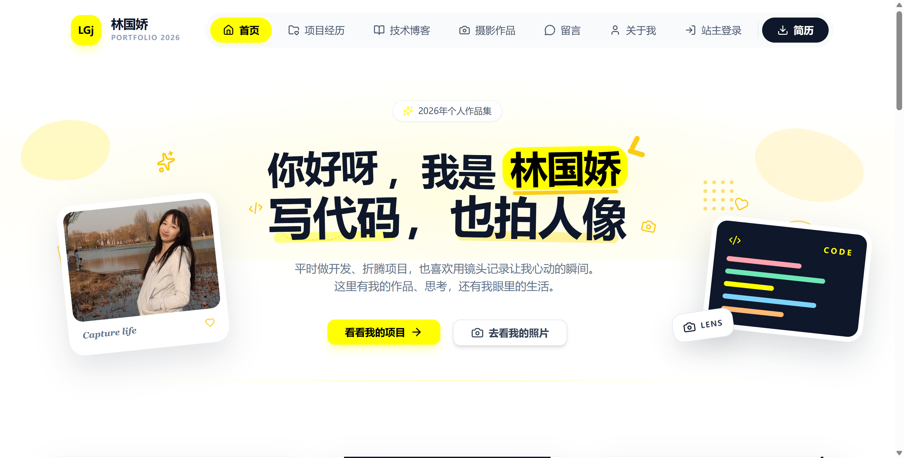
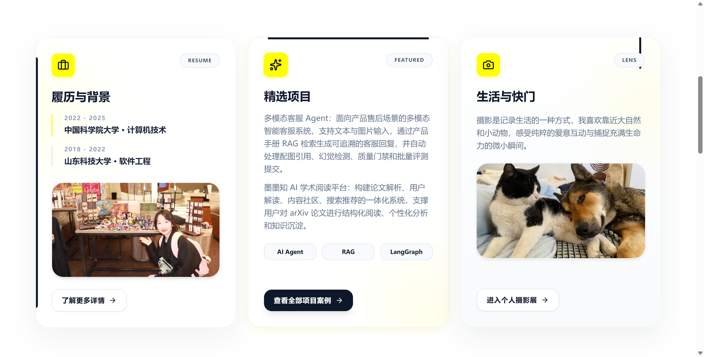
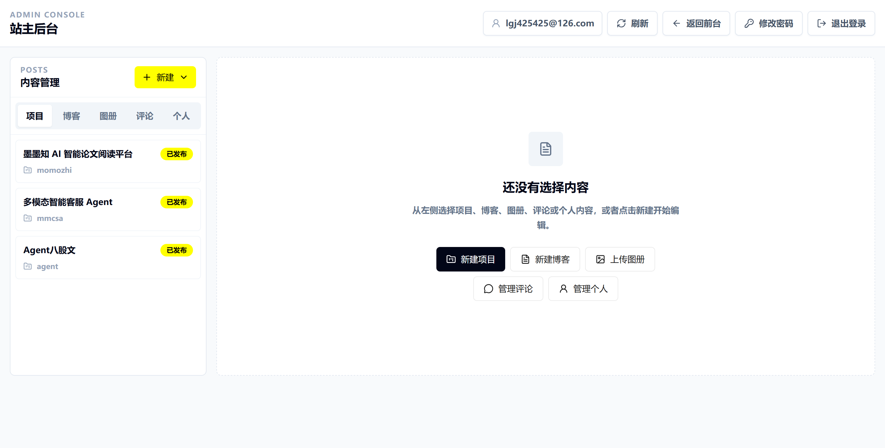
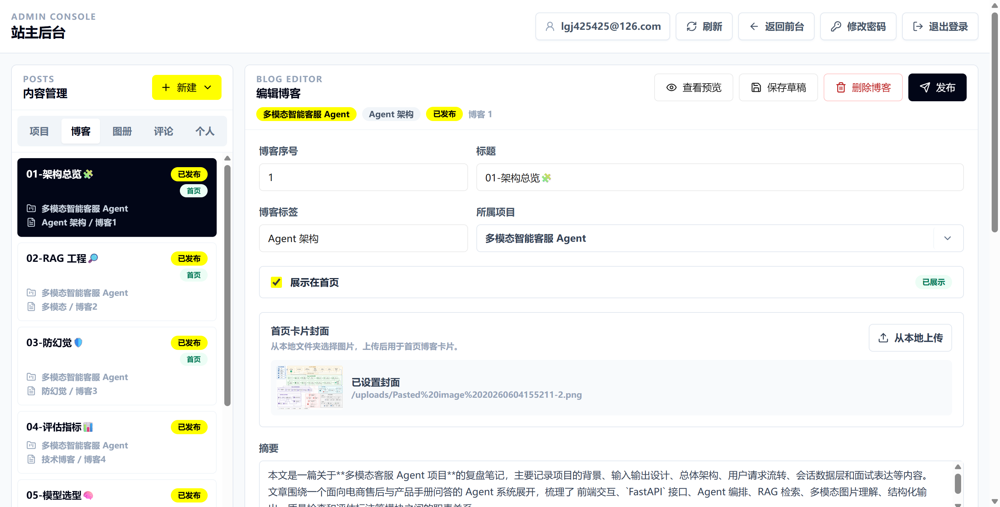

# 个人作品集网站

一个前后端分离的全栈个人网站，兼具作品展示与内容管理功能。已上线运行于 [mimolin.space](https://mimolin.space)。

> 系统从设计、开发、部署到运维由一人独立完成，开发周期 3 周，覆盖 8 张数据表、30+ REST 接口、10 个 Flyway 迁移版本。

**前台** — 首页、项目经历、技术博客、摄影图册、访客留言、关于我、简历，共 7 个页面。支持 Markdown 博客渲染（含 Mermaid 图表）、瀑布流图册浏览、树形评论与留言板。

**后台** — 完整 CMS 管理系统，覆盖项目、博客、图册、评论、简历版本、个人页 6 大模块的 CRUD，支持内容三态管理（草稿/发布/隐藏）、评论审核、媒体资源上传与实时 Markdown 预览。

## 文档

| 文档 | 说明 |
|------|------|
| [效果展示 SHOWCASE](docs/readme/SHOWCASE.md) | 前后台全部页面截图 |
| [项目简历](docs/项目简历.md) | 可直接用于简历的项目描述与亮点提炼 |

**项目技术文档：**

| 序号 | 文档 |
|------|------|
| 00 | [序章 — 项目总览与博客导读](docs/项目文档/00-序章-项目总览与博客导读.md) |
| 01 | [全栈架构与技术选型](docs/项目文档/01-全栈架构与技术选型.md) |
| 02 | [手写 Markdown 博客引擎](docs/项目文档/02-手写Markdown博客引擎.md) |
| 03 | [Spring Security 会话认证与授权](docs/项目文档/03-SpringSecurity会话认证与授权.md) |
| 04 | [内容建模与 REST API 设计](docs/项目文档/04-内容建模与REST-API设计.md) |
| 05 | [评论与留言系统设计](docs/项目文档/05-评论与留言系统设计.md) |
| 06 | [文件上传与静态资源安全](docs/项目文档/06-文件上传与静态资源安全.md) |

### 前台效果





### 后台效果






## 技术栈

| 模块 | 技术 |
|------|------|
| 前端 | React 18、Vite、TypeScript、React Router、Tailwind CSS、Radix UI、Lucide React |
| 后端 | Spring Boot 3、Java 17、Spring Security、Spring Data JPA、Flyway |
| 数据库 | PostgreSQL 16 |
| 静态资源 | 前端 `dist` 由 Nginx 托管，上传文件通过后端 `/uploads` 暴露 |
| 部署 | 腾讯云轻量应用服务器、Nginx、可选 EdgeOne 加速 |

## 目录结构

```text
personal-website/
├── docker-compose.yml       # 本地 PostgreSQL
├── backend/                 # Spring Boot 后端
│   ├── pom.xml
│   └── src/
├── docs/                    # 项目文档、图片素材、README 截图
├── src/                     # React 前端源码
├── index.html
├── package.json
└── vite.config.ts
```

## 部署资源参考

以下成本是项目记录里的估算，实际价格以云控制台为准。

| 事项 | 控制台 | 备注 |
|------|--------|------|
| 域名 | [阿里云域名控制台](https://dc.console.aliyun.com/next/index?spm=5176.27097949.J_9138996270.6.39284b59oG8Zaf#/overview) | 约 10 到 30 元/年 |
| 服务器 | [腾讯云轻量应用服务器](https://console.cloud.tencent.com/lighthouse/instance/index?rid=8) | 约 360 元/年 |
| 备案 | [腾讯云备案管理](https://console.cloud.tencent.com/beian/manage) | 约 12 个工作日 |
| 全球访问加速 | [腾讯云 EdgeOne](https://console.cloud.tencent.com/edgeone/zones) | 约 10 元/月，可选 |

## 本地运行

### 环境准备

- Node.js 20 或更高版本
- JDK 17
- Maven 3.9 或更高版本
- Docker Desktop，用来启动本地 PostgreSQL

### 启动数据库

```bash
cp .env.example .env
# 编辑 .env，至少改这三个值：
# DATABASE_PASSWORD
# SITE_ADMIN_EMAIL
# SITE_ADMIN_PASSWORD
docker compose up -d
```

默认会启动一个 PostgreSQL：

- 数据库：`personal_website`
- 用户名：`postgres`
- 密码：读取根目录 `.env` 里的 `DATABASE_PASSWORD`
- 端口：`5432`

### 启动后端

```bash
cd backend
mvn spring-boot:run
```

后端会自动读取根目录 `.env`。账号初始化和密码修改见下方「站主账号」。

### 站主账号

**首次设置：** 后端首次启动时，如果 `admin_users` 表为空，会用 `.env` 里的 `SITE_ADMIN_EMAIL` 和 `SITE_ADMIN_PASSWORD` 自动创建一个 OWNER 账号。已有管理员后，再改这两个变量不会新增账号，也不会覆盖密码。

**修改密码：** 登录后台 → 右上角「修改密码」，输入当前密码和新密码即可。改完后建议从 `.env`（本地）或 `/etc/personal-website.env`（生产）中删除 `SITE_ADMIN_PASSWORD`，后续改密码统一走后台入口。

后端默认运行在：

```text
http://127.0.0.1:18081
```

健康检查：

```bash
curl http://127.0.0.1:18081/api/health
```

正常返回：

```json
{"ok":true}
```

### 启动前端

回到项目根目录：

```bash
npm install
npm run dev
```

前端默认运行在：

```text
http://127.0.0.1:5173
```

本地开发时，Vite 会把 `/api` 和 `/uploads` 代理到 `http://127.0.0.1:18081`。如果后端端口不一样，可以设置：

```bash
export VITE_BACKEND_PROXY_TARGET="http://127.0.0.1:18081"
npm run dev
```

## 生产部署

下面以一台 Linux 服务器部署为例。推荐方式是：

- 后端用 Spring Boot JAR 跑在 `127.0.0.1:18081`
- 前端 `npm run build` 后把 `dist` 交给 Nginx
- Nginx 负责 `/`、`/api`、`/uploads` 的统一入口
- 域名解析到服务器公网 IP，备案完成后再正式上线

### 构建前端

在项目根目录执行：

```bash
npm ci
npm run build
```

构建产物在：

```text
dist/
```

如果前端和后端走同一个域名，生产构建时可以不设置 `VITE_ADMIN_API_URL`，前端会直接请求同域的 `/api`。

如果后端是单独域名，例如 `https://api.example.com`，构建前设置：

```bash
export VITE_ADMIN_API_URL="https://api.example.com"
npm run build
```

### 构建后端

```bash
cd backend
mvn clean package
```

构建产物类似：

```text
backend/target/personal-website-backend-0.1.0-SNAPSHOT.jar
```

服务器上可以放到：

```text
/opt/personal-website/backend/personal-website-backend.jar
```

### 配置后端环境变量

生产环境建议把配置放到 `/etc/personal-website.env`：

```bash
SERVER_PORT=18081
DATABASE_URL=jdbc:postgresql://127.0.0.1:5432/personal_website
DATABASE_USERNAME=personal_website
DATABASE_PASSWORD=replace-with-a-strong-password
SITE_ADMIN_EMAIL=your-email@example.com
SITE_ADMIN_PASSWORD=replace-with-a-strong-admin-password
SITE_CORS_ALLOWED_ORIGINS=https://example.com,https://www.example.com
SITE_UPLOADS_DIRECTORY=/opt/personal-website/uploads
SITE_UPLOADS_PUBLIC_PATH=/uploads
SITE_CONTENT_SEED_ENABLED=true
SITE_GALLERY_SEED_ENABLED=true
```

注意：

- `SITE_ADMIN_EMAIL` 和 `SITE_ADMIN_PASSWORD` 只用于首次初始化站主账号（详见「站主账号」），不要写进 Git。
- `SITE_UPLOADS_DIRECTORY` 要使用服务器上的持久化目录，避免发布新版本时把上传文件覆盖掉。
- 第一次启动时 Flyway 会自动建表，并从项目内置内容初始化项目、博客和图册数据。
- 如果服务器只上传后端 JAR，没有同步 `src/content/blog` 和 `docs/images/图册`，可以把
  `SITE_CONTENT_SEED_ENABLED`、`SITE_GALLERY_SEED_ENABLED` 改成 `false`，或者把这两个目录也复制到服务器。

### 用 systemd 托管后端

新建 `/etc/systemd/system/personal-website.service`：

```ini
[Unit]
Description=Personal Website Backend
After=network.target

[Service]
WorkingDirectory=/opt/personal-website/backend
EnvironmentFile=/etc/personal-website.env
ExecStart=/usr/bin/java -jar /opt/personal-website/backend/personal-website-backend.jar
Restart=always
RestartSec=5

[Install]
WantedBy=multi-user.target
```

启动服务：

```bash
sudo systemctl daemon-reload
sudo systemctl enable personal-website
sudo systemctl start personal-website
sudo systemctl status personal-website
```

### 配置 Nginx

假设前端构建产物放在：

```text
/var/www/personal-website/dist
```

Nginx 配置示例：

```nginx
server {
    listen 80;
    server_name example.com www.example.com;

    root /var/www/personal-website/dist;
    index index.html;

    location / {
        try_files $uri $uri/ /index.html;
    }

    location /api/ {
        proxy_pass http://127.0.0.1:18081;
        proxy_set_header Host $host;
        proxy_set_header X-Real-IP $remote_addr;
        proxy_set_header X-Forwarded-For $proxy_add_x_forwarded_for;
        proxy_set_header X-Forwarded-Proto $scheme;
    }

    location /uploads/ {
        proxy_pass http://127.0.0.1:18081;
        proxy_set_header Host $host;
        proxy_set_header X-Real-IP $remote_addr;
        proxy_set_header X-Forwarded-For $proxy_add_x_forwarded_for;
        proxy_set_header X-Forwarded-Proto $scheme;
    }
}
```

检查并重载：

```bash
sudo nginx -t
sudo systemctl reload nginx
```

上线 HTTPS 后，把 `SITE_CORS_ALLOWED_ORIGINS` 改成 HTTPS 域名，并在 Nginx 里补充 443 证书配置。

## 域名、备案和 EdgeOne

1. 在 [阿里云域名控制台](https://dc.console.aliyun.com/next/index?spm=5176.27097949.J_9138996270.6.39284b59oG8Zaf#/overview) 购买域名。
2. 在 [腾讯云轻量应用服务器](https://console.cloud.tencent.com/lighthouse/instance/index?rid=8) 准备服务器，安装 JDK、Node.js、Maven、Nginx 和 PostgreSQL。
3. 在 [腾讯云备案管理](https://console.cloud.tencent.com/beian/manage) 提交备案，通常需要等待一段工作日。
4. 备案通过后，把域名解析到服务器公网 IP。
5. 如果需要更好的全球访问速度，可以接入 [腾讯云 EdgeOne](https://console.cloud.tencent.com/edgeone/zones)，让 EdgeOne 回源到服务器域名。

## 发布前检查清单

- [ ] 后端 `/api/health` 返回 `{"ok":true}`
- [ ] 前端首页、项目页、博客页、图册页可以正常打开
- [ ] 后台可以登录，且能创建或编辑项目、博客、图册
- [ ] 上传图片后，刷新页面仍能访问
- [ ] `SITE_ADMIN_PASSWORD`、数据库密码等敏感信息没有提交到 Git
- [ ] 域名已备案，DNS 已指向服务器或 EdgeOne
