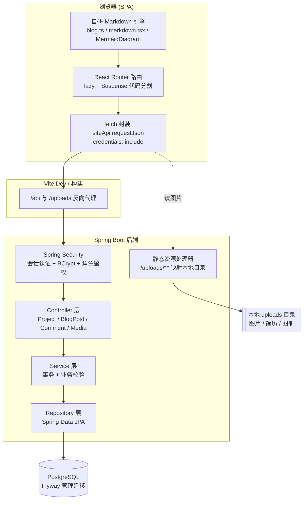

## 0. 这套文档是干什么的

这个仓库表面上是「个人网站」，但它不是一个用模板拼出来的主页。它是一个**前后端分离的全栈应用**：

- 前端：React 18 + Vite + TypeScript 的 SPA，带一个**完全自研的 Markdown 博客引擎**；
- 后端：Spring Boot 3.3.7 + Spring Security + JPA + Flyway + PostgreSQL 的 REST API，带一套**自建的内容管理后台（CMS）**；
- 还经历过一次架构迁移：评论/内容数据从 Supabase（BaaS）**迁回了自建的 Spring 后端**。

我写这套文档的目的很明确：**面试辅助**。面试官问「你这个网站做了什么」时，我不想只回答「就是个展示页」。这套文档把项目里真正有工程含量的部分拆成 6 章，每一章对应一个具体的、面试官会追问的能力点，并且**全部落到真实代码**——文中引用的每个类、方法、SQL 都能在仓库里找到。

> 一个原则贯穿全文：不编数据、不吹概念。能力点都来自仓库里跑得起来的代码，局限性也如实写出来，免得面试时被一句追问问穿。

## 1. 系统架构一图流

整条链路是：浏览器里的 SPA 通过 `fetch`（带会话 cookie）打到 Vite 代理，代理转发给 Spring Boot；后端用经典的 `Controller → Service → Repository` 三层处理请求，数据落 PostgreSQL，上传的二进制文件落本地目录再用静态资源处理器对外服务。

## 2. 六章地图：每章证明一个能力

| 章节 | 标题 | 证明的能力 | 难度 |
|---|---|---|---|
| 01 | [从 Supabase 到自建后端：全栈架构与技术选型](01-全栈架构与技术选型.md) | 系统设计 / 技术选型权衡 | 进阶 |
| 02 | [手写一个 Markdown 博客引擎](02-手写Markdown博客引擎.md) | 前端深度 / 编译期 vs 运行时 / XSS | 进阶 |
| 03 | [Spring Security 会话认证与授权](03-SpringSecurity会话认证与授权.md) | 后端安全 / 认证授权 | 进阶→高级 |
| 04 | [内容建模与 REST API 设计](04-内容建模与REST-API设计.md) | 后端数据建模 / 接口设计 | 进阶 |
| 05 | [评论 + 留言系统：多态、楼层、审核](05-评论与留言系统设计.md) | 系统设计 / 数据一致性 | 进阶 |
| 06 | [文件上传与静态资源的安全细节](06-文件上传与静态资源安全.md) | 安全 / IO 边界 | 进阶 |

阅读顺序就是 01 → 06：先鸟瞰架构，再讲前端最有料的自研引擎，然后进后端地基（安全 + 建模），最后落到两个后端深水区（评论系统、上传安全）。

## 3. 技术栈速查

| 层 | 技术 |
|---|---|
| 前端框架 | React 18、React Router 6、TypeScript |
| 构建 | Vite、Tailwind CSS、PostCSS |
| 前端能力 | 路由级代码分割、自研 Markdown 渲染、Mermaid 懒加载、framer-motion 动效 |
| 后端框架 | Spring Boot 3.3.7、Java 17 |
| 后端能力 | Spring Security（会话制）、Spring Data JPA / Hibernate、Bean Validation |
| 数据库 | PostgreSQL（生产）、H2（测试）、Flyway 迁移 |
| 测试 | JUnit 5、Spring Boot Test、MockMvc、`spring-security-test` |

## 4. 面试怎么用这套文档

- **一句话定位**：「这是一个我自己从前端写到后端、再写后台 CMS 的全栈项目，重点不是页面好看，而是几个工程点：自研 Markdown 引擎、会话认证体系、多态评论系统和上传安全。」
- **按岗位选章节**：前端岗主推 02，Java 后端岗主推 03/04/05/06，全栈岗用 01 串起来。
- **每章都有「面试口述版」和「面试官追问」**：口述版是 1–2 分钟能讲完的版本，追问部分是我提前想好的高频问题答案。

## 5. 提前准备好的「诚实风险点」

面试官如果较真往下挖，这几个点我会主动讲清楚，而不是等被问穿：

1. **后端关了 CSRF 又开了 CORS `allowCredentials`**（见 [第 3 章](03-SpringSecurity会话认证与授权.md)）：会话制下这是个真实权衡，我能讲清现状为什么可接受、生产该怎么补。
2. **前端装了多套 UI 库**（Radix / MUI / antd / arco / tdesign 并存）：这是迭代留下的技术债，该收敛到一套，我不回避。
3. **没有性能量化指标**：我不会编「性能提升 X%」，只讲设计本身解决了什么问题。
4. **自研 Markdown 引擎是「够用」而非「完备」**：它能 cover 我自己博客用到的语法子集，但不是 CommonMark 全量实现，[第 2 章](02-手写Markdown博客引擎.md)会说清楚边界。

---

下一章从架构选型讲起：我为什么没有止步于 Supabase，而是自己写了一个 Spring Boot 后端。
