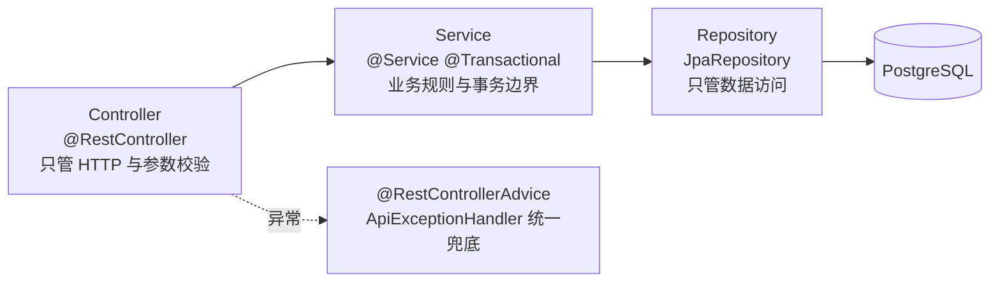

## 1. 开篇：一个个人网站值得做成全栈吗

大部分个人网站不需要后端。一个静态 SPA + 几个 Markdown 文件，部署到任何静态托管上就够了。这个项目一开始也是这样的：博客内容就是 `src/content/blog/` 下的一堆 `.md` 文件，构建时打进包里。

但当我想加这几个功能时，纯静态方案就不够了：

- 访客能在博客下**评论**、能在留言板**留言**，而且评论要先经过我**审核**才公开；
- 我能在一个**后台**里增删改查项目、博客、图册、简历，而不是每次都改代码、重新构建、重新部署；
- 这些数据要能**持久化**，并且我要能控制它的存储和迁移。

到这一步，问题就从「要不要后端」变成「后端怎么做」。

## 2. 第一版：用 Supabase 把闭环跑通

最早评论功能是接在 Supabase 上的（git 历史里 `评论删除功能+supabase` 这个提交就是那一版）。Supabase 是一个 BaaS：直接给你一个 Postgres、一套自动生成的 REST/Realtime API、还有 Auth 和存储。对一个想快速验证想法的个人项目来说，它的好处很直接：**不用自己写后端就能有数据库和接口**。

这一版让产品闭环先跑起来了。但用着用着，几个约束开始浮现：

- **鉴权和业务规则被托管层绑住**。评论的「先 pending、审核后才 approved」这种业务规则，放在 BaaS 的行级安全策略里表达，远不如放在我自己的 Service 层里直观；
- **数据和逻辑分散**。一部分逻辑在前端、一部分在 Supabase 的策略/函数里，调试和演进都别扭；
- **我想练的是后端工程本身**。对一个用于面试的项目，「我会用 BaaS」远不如「我能自己设计一套带认证、迁移、分层的后端」有说服力。

所以第二版我把它迁回了自建后端。

## 3. 第二版：自建 Spring Boot 后端

现在前端调用的不再是 Supabase SDK，而是一个统一的 `fetch` 封装 `requestJson`（[src/lib/siteApi.ts](../../src/lib/siteApi.ts)），打到我自己的 Spring Boot 服务：

```typescript
export const requestJson = async <T>(path: string, init?: RequestInit): Promise<T> => {
  let response: Response;
  try {
    response = await fetch(getApiUrl(path), {
      ...init,
      credentials: init?.credentials ?? 'include', // 关键：带上会话 cookie
      headers: {
        ...(init?.body ? { 'Content-Type': 'application/json' } : {}),
        ...init?.headers,
      },
    });
  } catch {
    throw new Error(createNetworkErrorMessage(path));
  }
  if (!response.ok) {
    throw new Error(await readApiError(response, '请求失败，请稍后再试。'));
  }
  if (response.status === 204) return undefined as T; // 204 不解析 body
  return response.json() as Promise<T>;
};
```

这里有几个能在面试里展开的小细节：

- `credentials: 'include'` 是会话认证能跑通的前提——它让浏览器在跨域请求里也带上 `JSESSIONID` cookie（对应后端 CORS 必须 `allowCredentials(true)`，见 [第 3 章](03-SpringSecurity会话认证与授权.md)）；
- 统一在一个地方读后端返回的 `{ "error": ... }` 错误体（`readApiError`），前端各处就不用各写一遍错误解析；
- 网络层异常（`fetch` 直接 throw）和业务层错误（`!response.ok`）被分开处理，给用户的提示也不一样——网络不通时直接提示「后端没启动 / 代理没配好」。

后端是经典的 Spring 三层架构：



以「发布一篇博客」为例，请求依次经过：[BlogPostController](../../backend/src/main/java/com/guojiaolin/website/content/BlogPostController.java)（接 HTTP、`@Valid` 校验入参）→ [BlogPostService](../../backend/src/main/java/com/guojiaolin/website/content/BlogPostService.java)（在事务里做 slug 唯一性校验、设置发布时间）→ [BlogPostRepository](../../backend/src/main/java/com/guojiaolin/website/content/BlogPostRepository.java)（Spring Data JPA 落库）。任何一层抛出的业务异常，都由 [ApiExceptionHandler](../../backend/src/main/java/com/guojiaolin/website/common/ApiExceptionHandler.java) 统一转成带 `error` 字段的 JSON，前端就能稳定地读到错误信息。

## 4. 前端选型：Vite + React Router + 代码分割

前端是 Vite 驱动的 React SPA。两个值得讲的工程决策：

**(1) 路由级代码分割。** 每个页面都用 `React.lazy` 懒加载，外面包一层 `Suspense` 给统一的加载态（[src/App.tsx](../../src/App.tsx)）：

```tsx
const Home = lazy(() => import('./pages/Home'));
const Blog = lazy(() => import('./pages/Blog'));
const Admin = lazy(() => import('./pages/Admin'));
// ...
<Suspense fallback={<Loading />}>
  <Routes>
    <Route path="/" element={<Home />} />
    <Route path="/blog" element={<Blog />} />
    <Route path="/admin" element={<Admin />} />
    {/* 旧链接重定向，避免老 URL 404 */}
    <Route path="/project/web3" element={<Navigate to="/project/mmcsa" replace />} />
  </Routes>
</Suspense>
```

效果是：首屏只加载首页那一块 JS，访客点进哪个页面才下载哪个页面的代码。后台 `Admin` 页又大又只有我自己用，单独分包对普通访客就是纯收益。

**(2) Vite 开发代理。** 前端 `5173`、后端 `18081`，本地开发用 Vite 代理把 `/api` 和 `/uploads` 转发到后端（[vite.config.ts](../../vite.config.ts)），这样前端代码里全程写相对路径 `/api/...`，开发和生产环境不用改地址：

```typescript
server: {
  proxy: {
    '/api':     { target: process.env.VITE_BACKEND_PROXY_TARGET || 'http://127.0.0.1:18081', changeOrigin: true },
    '/uploads': { target: process.env.VITE_BACKEND_PROXY_TARGET || 'http://127.0.0.1:18081', changeOrigin: true },
  },
},
```

**(3) 构建期图片优化。** 现在 `vite.config.ts` 里还有两层静态图片处理：一层是 `vite-plugin-image-optimizer`，负责常规资源优化；另一层是自定义的 `resizeLargeStaticImages` 插件，构建时用 `sharp` 把超过 500KB 的大图限制到最长边 1600px 左右，避免把原始大图直接打进生产包。

这和后端上传图片优化不是一回事：前端构建期优化处理的是仓库里的静态资源，后端上传优化处理的是后台上传进来的图片。两边都做，是因为图片来源不一样。

## 5. 数据与配置：环境变量驱动

后端配置全部走环境变量带默认值（[application.yml](../../backend/src/main/resources/application.yml)），本地能零配置起，生产能用环境变量覆盖：

```yaml
spring:
  datasource:
    url: ${DATABASE_URL:jdbc:postgresql://localhost:5432/personal_website}
  jpa:
    hibernate:
      ddl-auto: validate   # 不让 Hibernate 改表结构，表结构只由 Flyway 管
    open-in-view: false    # 关掉 OSIV，避免视图层触发懒加载查询
  flyway:
    enabled: true          # 启动时自动跑数据库迁移
```

两个我会主动讲的点：

- `ddl-auto: validate` + Flyway：**表结构的唯一事实来源是迁移脚本**，Hibernate 只负责「校验实体和表对得上」，绝不允许它自动建表/改表。这是把「能跑」和「可维护」分开的关键决策（详见 [第 4 章](04-内容建模与REST-API设计.md)）。
- `open-in-view: false`：默认开启的 OSIV 会把数据库 Session 一直撑到视图渲染完，容易在不经意间触发懒加载、产生 N+1。关掉它逼着我在 Service 的事务边界内就把要用的数据取完。

本地开发现在用一个脚本把三件事串起来：`npm run dev:all` 会先执行 `docker compose up -d` 启动 PostgreSQL，再启动 Spring Boot 后端，最后启动 Vite 前端。也就是说，正常情况下不需要手动先跑一遍 `docker compose up -d`。数据库重置没有写进这个脚本，因为 `docker compose down -v` 会删数据，属于高风险操作，应该手动确认后再执行。

## 6. 选型权衡总结

| 维度 | Supabase（第一版） | 自建 Spring Boot（第二版） |
|---|---|---|
| 起步速度 | 快，开箱即用 | 慢，要自己搭 |
| 业务规则表达 | 受托管层约束 | Service 层自由表达 |
| 认证/授权 | 用平台的 | 自己用 Spring Security 实现 |
| 数据迁移可控性 | 依赖平台 | Flyway 版本化，自己掌控 |
| 对「面试」的价值 | 「会用 BaaS」 | 「能设计后端」 |
| 运维成本 | 低 | 高（要自己管数据库、部署） |

结论不是「自建吊打 BaaS」。对很多真实业务，BaaS 是更理性的选择。我迁回自建，是因为这个项目的**目标**变了：从「快速跑通」变成「证明我能独立设计一套后端」。选型永远是跟着约束和目标走的——这恰恰是面试官想听到的判断力。

## 7. 面试口述版

> 这个网站是一个前后端分离的全栈项目。前端是 Vite + React + TypeScript 的 SPA，做了路由级代码分割和构建期图片优化，重点是一个我自己写的 Markdown 博客引擎。后端是 Spring Boot，经典的 Controller-Service-Repository 三层，数据库用 PostgreSQL，迁移用 Flyway 管。
>
> 这里有个真实的选型故事：评论和内容数据我最早是放在 Supabase 上的，先把闭环跑通。但后来我把它迁回了自己写的 Spring Boot 后端，原因是我想把业务规则（比如评论审核流程）、认证授权和数据迁移都掌握在自己手里，而不是绑在托管平台上。我不会说 BaaS 不好，它起步很快；只是这个项目的目标从「快速验证」变成了「完整地做一套后端」，所以做了这个取舍。本地开发用 `npm run dev:all` 把数据库、后端和前端一起拉起来，降低日常启动成本。

## 8. 面试官可能追问的问题

**Q1：你为什么不直接用 Supabase，非要自己写后端？是不是重复造轮子？**
对个人产品来说 Supabase 是更省事的选择，我不否认。我迁回自建有两个理由：一是业务规则（评论的 pending/approved 审核流、owner 评论免审）放在自己的 Service 层里表达更清晰、更好测试；二是这个项目要用于面试，「能独立设计带认证和迁移的后端」比「会调 BaaS 的 SDK」更能体现后端能力。选型是看目标的，不是看技术新旧。

**Q2：前端为什么要做代码分割？不分割会怎样？**
不分割的话所有页面的 JS 会打成一个大包，首屏要下载整站代码，包括只有我自己用的后台管理页。用 `React.lazy` + `Suspense` 做路由级分割后，访客点到哪个页面才加载哪块代码，首屏体积明显更小。后台 Admin 页又大又低频，单独分包对普通访客就是纯收益。

**Q3：`open-in-view: false` 是什么，为什么要关？**
OSIV（Open Session In View）是 Spring Boot 默认开启的，它会把数据库 Session 维持到视图渲染结束，好处是你在 Controller/视图层访问懒加载属性也不会报错。代价是 Session 生命周期太长、容易掩盖 N+1 查询。我关掉它，是想强制自己在 Service 的事务边界内就把需要的数据查完，让数据访问边界更清晰。

**Q4：前后端跨域是怎么解决的？**
本地开发用 Vite 代理：前端所有请求写相对路径 `/api/...`，Vite 把它转发到后端 18081 端口，浏览器视角下是同源，不涉及跨域。生产环境如果前后端不同源，就靠后端 Spring Security 里配置的 CORS（允许指定 origin、`allowCredentials(true)` 以便带会话 cookie）来放行，这部分在第 3 章细讲。

**Q5：这套架构有什么你不满意、想改进的地方？**
两点。一是前端历史上引入了好几套 UI 组件库（Radix、MUI、antd 等）并存，是迭代留下的技术债，应该收敛到一套；二是后端目前是单体，认证用的是服务端会话，如果要做多实例水平扩展，会话需要外置（比如 Redis 共享 Session）或者改成无状态的 token 方案——这是个明确的演进方向，不是现在的问题。

**Q6：为什么图片优化前后端都做，不重复吗？**
不重复。前端构建期优化处理的是仓库里的静态图片，比如首页、项目展示里随代码发布的资源；后端上传优化处理的是后台运行时上传进来的图片，比如图册、About 图片、首页图片槽位。来源不同，时机也不同，所以两边各管一段。
