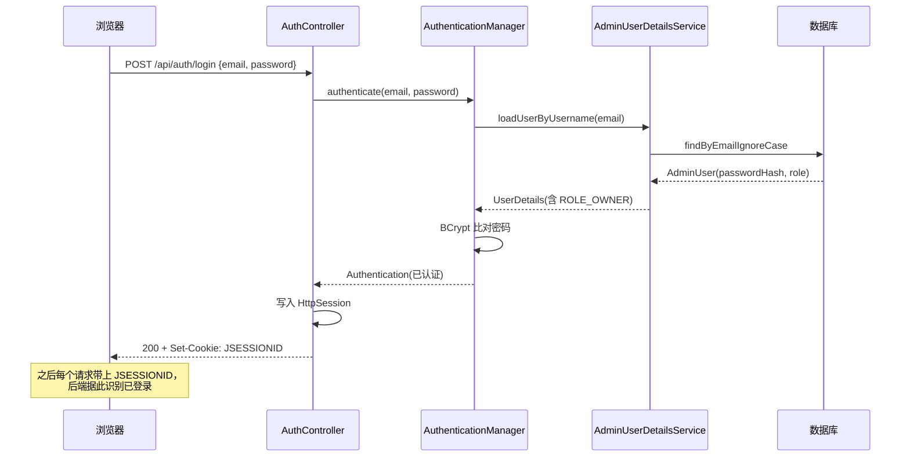

## 1. 开篇：这个后台只有我一个人能进

这个网站的后台（增删改项目、博客、审核评论、传图片）只有站主能用。所以后端要回答两个问题：

1. **认证（Authentication）**：你是不是站主？——登录。
2. **授权（Authorization）**：你能不能调这个接口？——鉴权。

我用 Spring Security 实现，选了**基于服务端会话（Session）**的方案，而不是 JWT。这一章讲清楚这套链路怎么搭、为什么这么选，以及边界在哪。

## 2. 登录链路：会话是怎么建立的

登录接口在 [AuthController](../../backend/src/main/java/com/guojiaolin/website/auth/AuthController.java)。它做的事是：用 `AuthenticationManager` 校验邮箱密码，校验通过后把认证信息**写进 HTTP Session**：

```java
@PostMapping("/login")
public AdminUserResponse login(@Valid @RequestBody LoginRequest request, HttpServletRequest servletRequest) {
  var authentication = authenticationManager.authenticate(
    new UsernamePasswordAuthenticationToken(request.email(), request.password())
  );
  SecurityContextHolder.getContext().setAuthentication(authentication);
  servletRequest.getSession(true).setAttribute(   // 关键：把 SecurityContext 显式存进 Session
    HttpSessionSecurityContextRepository.SPRING_SECURITY_CONTEXT_KEY,
    SecurityContextHolder.getContext()
  );
  return currentUser(authentication);
}
```



`AuthenticationManager` 内部会调用我实现的 [AdminUserDetailsService](../../backend/src/main/java/com/guojiaolin/website/security/AdminUserDetailsService.java)：按邮箱查出管理员，把数据库里的密码哈希和角色包装成 Spring Security 的 `UserDetails`，角色映射成 `ROLE_OWNER` 权限：

```java
@Override
public UserDetails loadUserByUsername(String username) {
  var user = users.findByEmailIgnoreCase(username)
    .orElseThrow(() -> new UsernameNotFoundException("Admin user not found."));
  return new User(user.getEmail(), user.getPasswordHash(),
    List.of(new SimpleGrantedAuthority("ROLE_" + user.getRole().name())));
}
```

登录成功后浏览器拿到 `JSESSIONID` cookie，之后每个请求自动带上它，后端就知道「这是已登录的站主」。配套还有两个接口：`GET /api/auth/me` 用来让前端刷新页面后确认登录态（没登录返回 401），`POST /api/auth/logout` 用 `SecurityContextLogoutHandler` 清掉会话。

## 3. 密码：BCrypt，永不明文

密码绝不明文存。[SecurityConfig](../../backend/src/main/java/com/guojiaolin/website/security/SecurityConfig.java) 里把 `PasswordEncoder` 定义成 `BCryptPasswordEncoder`：

```java
@Bean
PasswordEncoder passwordEncoder() {
  return new BCryptPasswordEncoder();
}
```

BCrypt 的好处是：自带随机 salt（同一个密码每次哈希结果都不同，防彩虹表）、有可调的 work factor（计算成本高，暴力破解慢）。数据库里 `admin_users.password_hash` 存的就是 BCrypt 哈希串（见 [V1 迁移](../../backend/src/main/resources/db/migration/V1__create_admin_content_tables.sql)）。登录时不是「解密比对」，而是 `AuthenticationManager` 用同样的 encoder 把输入密码哈希后比对——BCrypt 是单向的，没有「解密」一说。

## 4. 授权：哪些接口公开，哪些要登录

鉴权规则集中在 `SecurityConfig` 的过滤器链里，是一份很清楚的「接口可见性清单」：

```java
.authorizeHttpRequests(auth -> auth
  .requestMatchers(HttpMethod.PUT, "/api/auth/password").authenticated()
  .requestMatchers("/api/health", "/api/auth/login", "/api/auth/logout", "/api/auth/me").permitAll()
  .requestMatchers(HttpMethod.GET, "/api/projects/**", "/api/blog-posts/**").permitAll()
  .requestMatchers(HttpMethod.POST, "/api/comments").permitAll()
  .requestMatchers("/api/admin/**").authenticated()
  .anyRequest().permitAll()
)
```

设计思路：

- **读公开、写受限**。项目、博客、图册、About、简历、首页图片槽位这些前台内容要给访客看，所以公开读接口放行；增删改集中在 `/api/admin/**`，必须登录；
- **改密码单独鉴权**。`PUT /api/auth/password` 不在 `/api/admin/**` 下，但它会改当前站主凭证，所以单独声明 `.authenticated()`；
- **评论提交开放，但要审核**。`POST /api/comments` 允许匿名访客调用，但提交后是 `PENDING` 状态，要站主审核才公开（详见 [第 5 章](05-评论与留言系统设计.md)）。这是「接口开放」和「内容受控」的分离；
- **统一前缀做授权边界**。所有后台接口都挂在 `/api/admin/**` 下，一条 `.authenticated()` 就把整个后台保护住，新增后台接口自动受保护，不会漏。

未登录访问 `/api/admin/**` 时，我自定义了 401 返回（而不是默认重定向到登录页，因为这是给 SPA 用的 JSON API）：

```java
.exceptionHandling(errors -> errors.authenticationEntryPoint((request, response, error) -> {
  response.setStatus(401);
  response.setContentType("application/json");
  response.getWriter().write("{\"error\":\"Authentication required.\"}");
}));
```

前端的 `fetch` 封装看到 401 就知道「该跳登录了」，而不是拿到一坨 HTML 登录页。

## 5. 会话 vs JWT：我为什么选会话

这是面试必问的取舍，我提前想清楚了。

| 维度 | 服务端会话（本项目） | JWT（无状态 token） |
|---|---|---|
| 状态 | 有状态，服务端存 Session | 无状态，token 自包含 |
| 注销/吊销 | 简单，删 Session 即可 | 难，token 签发后到期前一直有效 |
| 水平扩展 | 需共享 Session（如 Redis） | 天然适合多实例 |
| 存储位置 | `JSESSIONID` 放 cookie | 通常放 cookie 或 localStorage |
| 适用场景 | 单体、后台、强注销需求 | 微服务、跨域 API、移动端 |

我选会话的理由很实在：这是**一个单体后端 + 一个站主用的后台**，不存在多实例扩展压力；会话能即时注销（JWT 想做到这点要额外维护黑名单）；而且把 `JSESSIONID` 放在 `HttpOnly` cookie 里，JS 读不到，比把 token 塞 localStorage 更难被 XSS 偷走。

会话 cookie 的安全属性在 [application.yml](../../backend/src/main/resources/application.yml) 里配了：

```yaml
server:
  servlet:
    session:
      cookie:
        http-only: true   # JS 读不到，防 XSS 窃取
        same-site: lax    # 限制跨站携带，缓解 CSRF
```

## 6. CSRF token：会话写接口不能只靠 cookie

会话认证有一个天然问题：浏览器会自动带 cookie。如果只靠 `JSESSIONID` 判断身份，恶意网站就可能诱导已登录用户发起跨站写请求。所以当前代码启用了 Spring Security 的 CSRF token 机制，让后台写操作除了会话 cookie 之外，还要提供一个请求头 token：

```java
.csrf(csrf -> csrf
  .csrfTokenRepository(CookieCsrfTokenRepository.withHttpOnlyFalse())
  .csrfTokenRequestHandler(csrfTokenHandler)
  .ignoringRequestMatchers("/api/health", "/api/comments")
)
.cors(withDefaults())
```

这里有几个取舍：

- **为什么 token cookie 不是 HttpOnly**：`XSRF-TOKEN` 需要被前端 JavaScript 读出来，再放到 `X-XSRF-TOKEN` 请求头里；真正不能被 JS 读取的是会话 cookie `JSESSIONID`。
- **为什么忽略 `/api/comments`**：评论提交允许匿名访客调用，提交后默认进入审核流，不会直接公开；如果也强制 CSRF，会让普通访客评论流程变复杂。
- **CORS 仍然开凭证，但有白名单**：`allowCredentials(true)` 是为了跨端口开发时带上会话 cookie；`allowedOrigins` 只允许配置里的前端域名，不能写成 `*`。

前端配套也做了统一封装：[siteApi.ts](../../src/lib/siteApi.ts) 会从 cookie 里读 `XSRF-TOKEN`，有值时自动加到 `X-XSRF-TOKEN` 请求头；文件上传走 [adminApi.ts](../../src/lib/adminApi.ts) 的 `uploadFetch`，同样会带这个头。这样每个页面不用各写一遍 CSRF 处理。

## 7. 第一个管理员从哪来：种子化

鸡生蛋问题——没有管理员就没法登录，但建管理员的接口又要登录。我用启动时种子化解决（[AdminUserSeeder](../../backend/src/main/java/com/guojiaolin/website/admin/AdminUserSeeder.java)）：

```java
@Component
public class AdminUserSeeder implements ApplicationRunner {
  @Override @Transactional
  public void run(ApplicationArguments args) {
    if (!StringUtils.hasText(email) || !StringUtils.hasText(password)) return; // 没配就不种
    users.findByEmailIgnoreCase(email).orElseGet(() -> {       // 幂等：已存在就不重复建
      var user = new AdminUser();
      user.setEmail(email.trim().toLowerCase());
      user.setPasswordHash(passwordEncoder.encode(password));  // 种进去也是 BCrypt 哈希
      user.setRole(AdminRole.OWNER);
      return users.save(user);
    });
  }
}
```

要点：管理员邮箱密码来自**环境变量**（`SITE_ADMIN_EMAIL` / `SITE_ADMIN_PASSWORD`），不写死在代码里；逻辑是**幂等**的（已存在就跳过，重启不会重复建）；种进去的密码同样经 BCrypt 哈希。

## 8. 用集成测试证明它真的对

认证这种东西，「我觉得对」不算数，要有测试。[AuthFlowIntegrationTest](../../backend/src/test/java/com/guojiaolin/website/AuthFlowIntegrationTest.java) 用 MockMvc 跑了真实的会话流程：

```java
@Test
void adminEndpointsRequireLoginAndLoginCreatesSession() throws Exception {
  mockMvc.perform(get("/api/admin/projects"))           // 没登录访问后台
    .andExpect(status().isUnauthorized());              // -> 401

  var session = new MockHttpSession();
  mockMvc.perform(post("/api/auth/login").session(session)
      .contentType("application/json")
      .content("""{ "email": "owner@example.com", "password": "correct-password" }"""))
    .andExpect(status().isOk())
    .andExpect(jsonPath("$.role").value("OWNER"));       // 登录成功，返回角色

  mockMvc.perform(get("/api/admin/projects").session(session))  // 带着会话再访问
    .andExpect(status().isOk());                                // -> 200
}

@Test
void loginRejectsWrongPassword() throws Exception {        // 错密码必须被拒
  mockMvc.perform(post("/api/auth/login") /* wrong-password */)
    .andExpect(status().isUnauthorized());
}
```

这两个用例把核心契约钉死了：**未登录访问后台返回 401、正确登录建立会话后可访问、错误密码被拒**。

内容相关的集成测试还会在后台写接口上加 `.with(csrf())`，例如创建项目、上传图片、审核评论、修改首页图册槽位等。这样测试层也承认一个事实：后台写操作不只是“有登录态”就够，还要带合法的 CSRF token。

## 9. 面试口述版

> 后台的认证授权是用 Spring Security 做的，方案是基于服务端会话。登录时 `AuthenticationManager` 调我实现的 `UserDetailsService` 按邮箱查管理员，用 BCrypt 比对密码，通过后把 SecurityContext 写进 HttpSession，浏览器拿到 HttpOnly 的 JSESSIONID，之后请求自动带上。
>
> 授权用的是基于角色的接口匹配：项目和博客的 GET 公开，评论提交开放但要审核，所有 `/api/admin/**` 一律要登录，未登录访问返回自定义的 401 JSON 而不是重定向，方便 SPA 处理。
>
> 我选会话而不是 JWT，是因为这是个单体后端、站主自用的后台，会话能即时注销、HttpOnly cookie 也比 localStorage 里的 token 更难被 XSS 偷。CSRF 这块现在启用了 Spring Security 的 token 机制：后端发 `XSRF-TOKEN`，前端写操作统一带 `X-XSRF-TOKEN`，同时 CORS 只允许白名单 origin。第一个管理员是启动时用环境变量幂等种子化的。整条流程有 MockMvc 集成测试覆盖。

## 10. 面试官可能追问的问题

**Q1：会话和 JWT 怎么选？你为什么选会话？**
看场景。JWT 无状态、适合微服务和水平扩展，但注销/吊销麻烦。会话有状态、要服务端存，但注销简单、能即时失效。我这是单体后端 + 单用户后台，没有扩展压力，强注销需求更重要，所以选会话。如果以后要多实例，会话需要外置到 Redis 共享，或者改成 JWT。

**Q2：密码为什么用 BCrypt，不用 MD5/SHA？**
MD5/SHA 是快速哈希，本来是为速度设计的，正好方便攻击者暴力破解，而且不带 salt 容易被彩虹表打穿。BCrypt 是专门为存密码设计的：自带随机 salt（同密码哈希结果不同）、work factor 可调（故意算得慢）。所以存密码要用 BCrypt（或 scrypt/argon2 这类），不用通用哈希。

**Q3：你这个会话认证怎么防 CSRF？**
现在用 Spring Security 的 CSRF token 机制。后端用 `CookieCsrfTokenRepository` 发一个 `XSRF-TOKEN` cookie，前端从 cookie 里读出来，写操作时放到 `X-XSRF-TOKEN` 请求头。攻击者能诱导浏览器带上 cookie，但读不到这个 token，也就拼不出合法请求头。评论提交是例外，因为它允许匿名访客提交，内容还要走审核。

**Q4：`SameSite=Lax` 和 `HttpOnly` 分别防什么？**
`HttpOnly` 让 JavaScript 读不到这个 cookie，主要防 XSS 把会话 ID 偷走。`SameSite=Lax` 限制 cookie 在跨站请求里的携带（顶级导航之外的跨站请求不带），主要缓解 CSRF。两个防的是不同攻击面。

**Q5：第一个管理员怎么创建？不会有先有鸡还是先有蛋的问题吗？**
会，所以用启动时种子化解决。`AdminUserSeeder` 实现 `ApplicationRunner`，应用启动时读环境变量里的管理员邮箱密码，如果该用户不存在就创建（密码同样 BCrypt 哈希）。逻辑是幂等的，已存在就跳过，所以重启安全。凭证走环境变量不写死在代码里。

**Q6：`/api/auth/me` 这个接口是干嘛的？**
给前端确认登录态用。SPA 刷新后内存里的登录状态没了，但浏览器还带着会话 cookie。前端启动时调一次 `/api/auth/me`：返回 200 + 用户信息说明还登录着，返回 401 说明要重新登录。它让「会话在后端、UI 状态在前端」这两边能对上。
