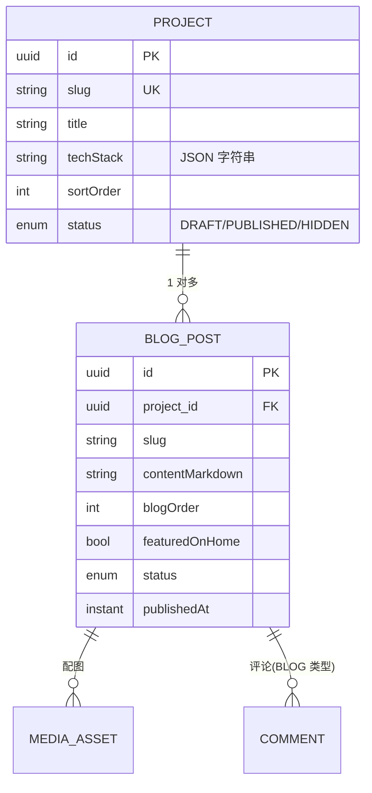

## 1. 领域模型：项目是文件夹，博客是文件夹里的文件

内容的核心关系很简单：一个**项目（Project）**下有多篇**博客（BlogPost）**。前端「技术博客」页就是按这个结构组织的——先看项目文件夹，点进去看这个项目的博客列表。



`BlogPost` 通过 `@ManyToOne` 挂到 `Project`（[BlogPost.java](../../backend/src/main/java/com/guojiaolin/website/content/BlogPost.java)），数据库里是 `project_id` 外键，并且 `on delete cascade`——删项目会连带删它的博客（[V1 迁移](../../backend/src/main/resources/db/migration/V1__create_admin_content_tables.sql)）。

## 2. 审计基类：每张表都自带 id 和时间戳

每个实体都继承 [AuditedEntity](../../backend/src/main/java/com/guojiaolin/website/common/AuditedEntity.java)，它用 `@MappedSuperclass` 把「主键 + 创建/更新时间」抽出来，靠 JPA 生命周期回调自动维护：

```java
@MappedSuperclass
public abstract class AuditedEntity {
  @Id @GeneratedValue
  private UUID id;
  @Column(nullable = false, updatable = false)
  private Instant createdAt;
  @Column(nullable = false)
  private Instant updatedAt;

  @PrePersist void prePersist() { var now = Instant.now(); createdAt = now; updatedAt = now; }
  @PreUpdate  void preUpdate()  { updatedAt = Instant.now(); }
}
```

好处：所有业务实体不用各自重复写这四个字段和时间维护逻辑；`createdAt` 标了 `updatable = false`，从映射层就保证它创建后不会被改。主键用 `UUID` 而不是自增整数——UUID 不暴露数据量、不可被遍历猜测（自增 id 会让人知道「你一共有多少篇博客」）。

## 3. 状态机：草稿、发布、隐藏

项目和博客都有一个 `ContentStatus`：`DRAFT / PUBLISHED / HIDDEN`（[ContentStatus.java](../../backend/src/main/java/com/guojiaolin/website/content/ContentStatus.java)）。这是内容系统的核心——**写作和发布要分离**：

- `DRAFT`：草稿，只有后台能看到，公开接口查不到；
- `PUBLISHED`：已发布，公开可见；
- `HIDDEN`：发过又下架的，公开不可见但数据还在。

这个枚举还做了一个 API 友好的处理：对外用小写字符串（`"published"`），对内是枚举常量，用 Jackson 的 `@JsonValue` / `@JsonCreator` 双向映射，且解析时大小写不敏感：

```java
public enum ContentStatus {
  DRAFT("draft"), PUBLISHED("published"), HIDDEN("hidden");
  @JsonValue   public String getValue() { return value; }              // 序列化成 "published"
  @JsonCreator public static ContentStatus fromJson(String value) {    // 反序列化容错
    // 同时接受 "published" 和 "PUBLISHED"
  }
}
```

「公开只看已发布」这条规则落在 Repository 的查询方法上——公开查询都带 `status = PUBLISHED` 条件，后台查询才查全部（[BlogPostService](../../backend/src/main/java/com/guojiaolin/website/content/BlogPostService.java)）：

```java
public List<BlogPostResponse> listPublished() {                 // 公开：只查已发布
  return blogPosts.findAllByStatus(ContentStatus.PUBLISHED, BLOG_SORT)...;
}
public List<BlogPostResponse> listAdmin() {                     // 后台：查全部
  return blogPosts.findAll(BLOG_SORT)...;
}
```

集成测试专门验证了这条边界：[ContentApiIntegrationTest](../../backend/src/test/java/com/guojiaolin/website/ContentApiIntegrationTest.java) 里建一个 `published` 内容、改成 `hidden` 后，公开接口立刻查不到，但后台接口还能查到。

## 4. 那一列 JSON：techStack 为什么不建关联表

`Project` 的 `techStack`（技术栈标签，如 `["React", "Spring Boot"]`）我没有建一张 `project_tech_stack` 关联表，而是**存成一列 JSON 字符串**（`projects.tech_stack text`）。负责转换的是 [JsonListMapper](../../backend/src/main/java/com/guojiaolin/website/content/JsonListMapper.java)：

```java
@Component
public class JsonListMapper {
  public String toJson(List<String> values) {            // 存：List -> JSON 字符串
    return objectMapper.writeValueAsString(values == null ? List.of() : values);
  }
  public List<String> fromJson(String json) {            // 取：JSON 字符串 -> List
    if (json == null || json.isBlank()) return List.of();
    try { return objectMapper.readValue(json, STRING_LIST); }
    catch (JsonProcessingException e) { return List.of(); } // 解析失败降级成空列表，不抛
  }
}
```

这是个**有意识的取舍**，面试时我会两面都讲：

| | 一列 JSON（本项目选这个） | 关联表（规范化） |
|---|---|---|
| 读写 | 一次就拿到整个列表 | 要 join 或多查一次 |
| 适用 | 标签只整体读写、不需要按标签查询 | 需要「按某标签筛项目」时 |
| 代价 | 没法在数据库层按单个标签高效查询 | 多一张表、多一层 join |

我选 JSON 列，是因为 `techStack` 在这个系统里**只跟着项目整体读写**——展示项目时一起显示，从没有「列出所有用了 React 的项目」这种查询需求。一旦有了按标签检索的需求，正确做法就是拆成关联表。`fromJson` 里解析失败降级成空列表而不是抛异常，是防御性的——一行脏数据不该让整个项目列表接口挂掉。

## 5. DTO 边界：请求和响应都不直接用实体

接口的入参和出参都是独立的 record，不直接暴露 JPA 实体。以博客为例：

- 入参 [BlogPostRequest](../../backend/src/main/java/com/guojiaolin/website/content/dto/BlogPostRequest.java)：带 Bean Validation 注解，把校验前移到入口；
- 出参 [BlogPostResponse](../../backend/src/main/java/com/guojiaolin/website/content/dto/BlogPostResponse.java)：用静态 `from(BlogPost)` 工厂把实体摊平，**还顺手把关联的 project 的 slug/title 拍扁进来**，前端不用再发一次请求查项目。

```java
public record BlogPostRequest(
  @NotNull UUID projectId,
  @NotBlank @Size(max = 240) String title,
  @NotBlank @Pattern(regexp = "^[a-z0-9]+(?:-[a-z0-9]+)*$") String slug,  // slug 必须是 kebab-case
  @NotBlank @Size(max = 1000) String summary,
  @NotBlank String contentMarkdown,
  /* ... */ ContentStatus status
) {}
```

那个 `slug` 的正则 `^[a-z0-9]+(?:-[a-z0-9]+)*$` 强制 slug 是「小写字母数字 + 单个连字符分隔」的格式（`rag-retrieval` 合法，`RAG_Retrieval`、`-x`、`a--b` 都不合法）。这保证 slug 能安全地拼进 URL，校验在 `@Valid` 阶段就完成，根本进不了 Service。校验失败由 [ApiExceptionHandler](../../backend/src/main/java/com/guojiaolin/website/common/ApiExceptionHandler.java) 统一转成 400 + `{"error": "Request validation failed."}`。

为什么用 DTO 而不直接传实体：① 实体带 JPA 关联和懒加载代理，直接序列化容易触发意外查询或循环引用；② 入参用独立 DTO 才能精确控制「客户端能传哪些字段」，防止有人多塞一个 `status` 把草稿直接变发布（mass assignment）；③ 内部表结构能演进，对外契约保持稳定。

## 6. 一个容易错的契约：slug 的唯一性范围

博客的 slug **不是全局唯一，而是项目内唯一**。也就是说项目 A 和项目 B 下可以各有一篇 `intro`。这条规则在 Service 层用「项目内查重」实现（[BlogPostService.create](../../backend/src/main/java/com/guojiaolin/website/content/BlogPostService.java)）：

```java
if (blogPosts.existsByProject_IdAndSlugIgnoreCase(project.getId(), request.slug())) {
  throw new BadRequestException("Blog post slug already exists.");
}
```

更新时还要排除自己，避免「改别的字段时被自己的 slug 卡住」：

```java
blogPosts.findByProject_IdAndSlugIgnoreCase(project.getId(), request.slug())
  .filter(existing -> !existing.getId().equals(id))   // 同名的如果是自己，放行
  .ifPresent(existing -> { throw new BadRequestException("Blog post slug already exists."); });
```

这正是集成测试 `blogPostSlugCanRepeatAcrossDifferentProjects` 钉住的契约：两个不同项目下建同名 slug `blog-1`，都能成功，且能通过 `/api/projects/{projectSlug}/blog-posts/{slug}` 分别取到。所以公开接口同时提供了「全局 slug」和「项目+slug」两种取文章方式（[BlogPostController](../../backend/src/main/java/com/guojiaolin/website/content/BlogPostController.java)），后者才能消除跨项目同名的歧义。

## 7. 排序与「首页精选」：把展示逻辑放进查询

列表的排序规则用 `Sort` 常量声明式表达，而不是查出来再在内存里排（[BlogPostService](../../backend/src/main/java/com/guojiaolin/website/content/BlogPostService.java)）：

```java
private static final Sort BLOG_SORT = Sort.by("blogOrder").ascending()
  .and(Sort.by("publishedAt").descending());  // 先按手工序号升序，再按发布时间倒序
```

首页精选是一个更具体的小功能：博客有 `featuredOnHome` 和 `homeOrder` 两个字段，首页只展示「标记了精选 + 已发布」的前 3 篇：

```java
public List<BlogPostResponse> listHomeFeatured() {
  return blogPosts.findAllByStatusAndFeaturedOnHome(ContentStatus.PUBLISHED, true, HOME_FEATURED_SORT)
    .stream().limit(HOME_FEATURED_LIMIT) /* = 3 */ ...;
}
```

集成测试 `homeFeaturedBlogPostsAreManagedFromAdminFields` 验证了一串边界：精选最多 3 篇、按 `homeOrder` 升序、`hidden` 的不算、没标精选的不算。把这些展示规则用字段 + 查询表达，而不是散落在前端，是「后端定义内容规则」的体现。

## 8. 数据库迁移：表结构是代码，由 Flyway 管

前面 [第 1 章](01-全栈架构与技术选型.md)提过 `ddl-auto: validate`——Hibernate 不许碰表结构。表结构的唯一事实来源是 `db/migration/` 下的 Flyway 脚本，按 `V1 / V2 / V3 / V4` 版本顺序执行：

- `V1` 建表（admin_users / projects / blog_posts / comments / media_assets）和索引；
- `V2` 把已有项目数据种进去；
- `V3` 把已有博客种进去；
- `V4` 把 media_assets 收紧到「属于某篇博客」。

好处是表结构变更**可追溯、可重放、和代码一起进版本库**。`V1` 里也能看到不少建模意识：状态字段用 `check` 约束兜底（`status in ('DRAFT','PUBLISHED','HIDDEN')`）、为高频查询建了复合索引：

```sql
create index blog_posts_status_order_idx on blog_posts (status, blog_order asc, published_at desc);
```

这个索引的列顺序正好对应公开列表的查询模式（按 status 过滤 + 按 blog_order/published_at 排序），不是随手建的。

## 9. 面试口述版

> 内容这块的领域模型是「项目 1 对多博客」，博客通过外键挂项目，删项目级联删博客。所有实体继承一个审计基类，统一用 UUID 主键、自动维护创建/更新时间。
>
> 内容有个 DRAFT/PUBLISHED/HIDDEN 状态机，把写作和发布分离：公开接口的查询都带 `status = PUBLISHED` 条件，后台接口才查全部。技术栈标签我存成一列 JSON 而不是关联表，因为它只跟着项目整体读写、没有按标签检索的需求——有这个需求我才会拆表。
>
> 接口入参出参都用独立 DTO：入参带 Bean Validation，slug 用正则强制 kebab-case，校验在 `@Valid` 阶段完成；出参把关联项目的字段拍扁，省前端一次请求。有个容易错的契约是 slug 项目内唯一而非全局唯一，更新查重时要排除自己，这条我用集成测试钉住了。表结构全部由 Flyway 版本化管理，Hibernate 只做 validate 不改表。

## 10. 面试官可能追问的问题

**Q1：techStack 为什么存 JSON 不建关联表？这不是反范式吗？**
是反范式，但是有意识的。判断标准是访问模式：`techStack` 在这个系统里只跟着项目整体读写，从没有「按某个标签筛项目」的需求。这种情况下一列 JSON 一次就读全、省一次 join，更简单。代价是数据库层没法高效地按单个标签查。一旦出现按标签检索的需求，正确做法就是拆成关联表。反范式不是错，脱离访问模式谈范式才是。

**Q2：状态用枚举存字符串，不怕以后加状态时出问题吗？**
用 `@Enumerated(EnumType.STRING)` 存字符串而不是序号（ORDINAL），就是为了安全演进——存序号的话，枚举中间插一个值会让所有历史数据错位。存字符串后加状态只是多一个常量，老数据不受影响。数据库层还加了 `check` 约束，从两边都限定取值范围。

**Q3：为什么一定要用 DTO，不能直接返回实体吗？**
三个原因。一是 JPA 实体带懒加载代理和关联，直接序列化可能触发意外查询或循环引用；二是入参用 DTO 才能精确控制客户端能改哪些字段，防止 mass assignment——比如有人在创建草稿时多塞个 `status: published` 直接绕过流程；三是 DTO 让内部表结构和对外 API 契约解耦，表能改，契约不变。

**Q4：slug 项目内唯一是怎么保证的？并发下会不会重复？**
Service 层 `create` 时用 `existsByProject_IdAndSlugIgnoreCase` 查重，`update` 时查重并排除自己。要诚实说：纯应用层查重在高并发下有竞态——两个请求同时查都说「不存在」然后都插入。真正兜底应该在数据库加 `(project_id, slug)` 的唯一约束。当前项目是单用户后台、并发几乎为零，所以应用层够用，但我知道严格场景要加 DB 唯一约束。

**Q5：Flyway 解决了什么？不用它直接让 Hibernate 建表不行吗？**
`ddl-auto: update` 让 Hibernate 自动改表，在演示项目里方便，但生产上危险——它的变更不可控、不可审计、可能丢数据，且团队协作时无法对账。Flyway 把每次表结构变更写成版本化的 SQL 脚本，按顺序执行、可追溯、可重放、和代码一起进版本库。我用 `ddl-auto: validate` 让 Hibernate 只校验「实体和表对得上」，结构变更全交给 Flyway。

**Q6：那个复合索引 `(status, blog_order, published_at)` 的列顺序有讲究吗？**
有。复合索引遵循最左前缀原则，列顺序要匹配查询模式。公开博客列表的查询是「先按 status 等值过滤，再按 blog_order 升序、published_at 降序排序」，索引列顺序正好照这个排：等值条件列在最前，排序列在后，这样过滤和排序都能走索引，避免额外的排序操作。
