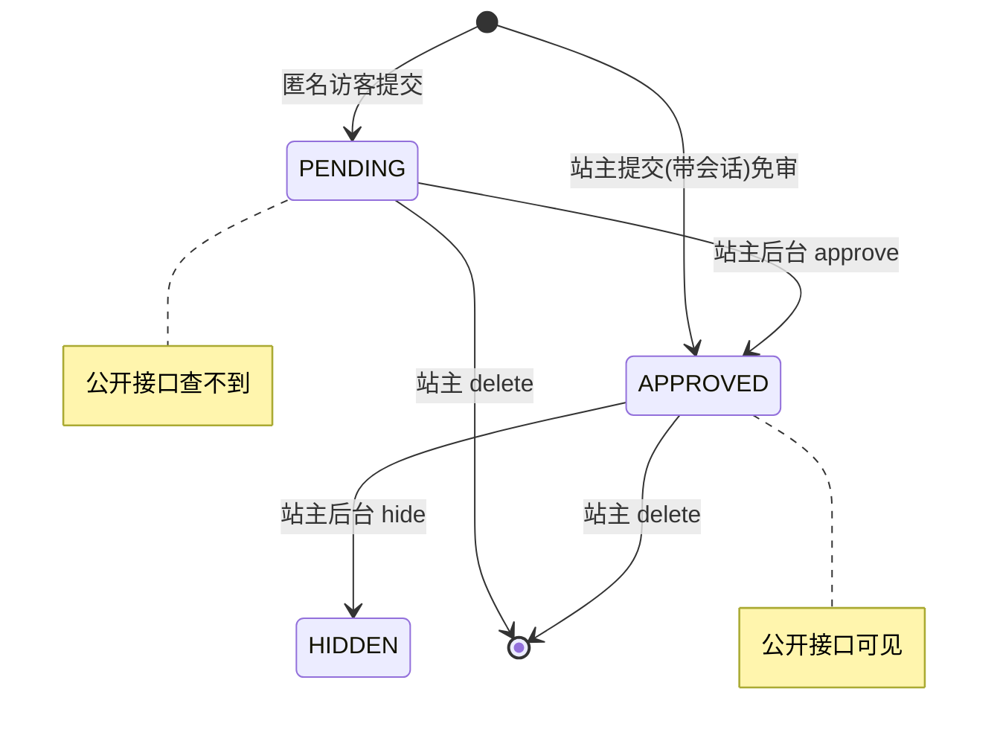
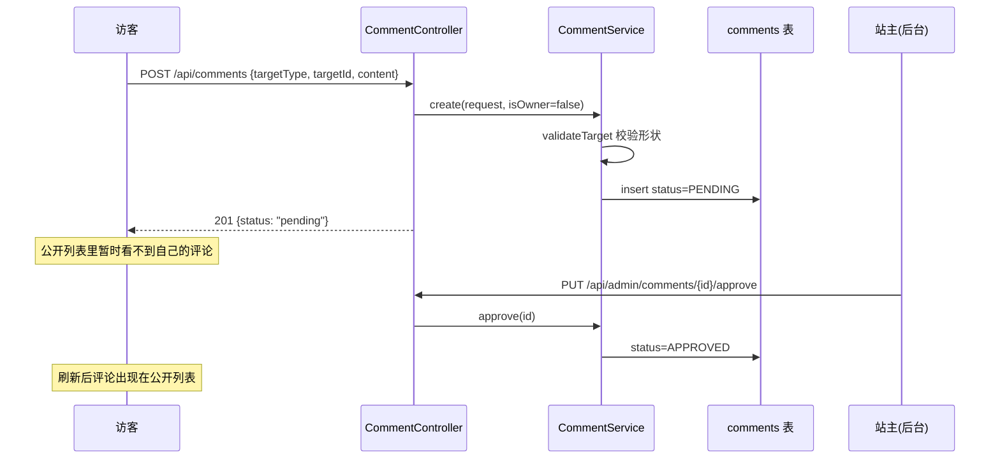

## 1. 开篇：把「评论系统」这道题落到真实代码

很多人答「设计一个评论系统」会停在「一张 comments 表，有 content、author、created_at」。这篇我想答得更深一点，因为这个项目里的评论系统要同时满足几个真实约束：

1. **两种场景共用**：博客文章下的评论，和独立的留言板（guestbook），是一套机制；
2. **要审核**：匿名访客的评论先进「待审」，站主审核通过才公开——防垃圾和不当内容；
3. **能盖楼**：评论下能有回复；
4. **站主特权**：站主自己发的评论/回复免审，直接公开。

下面逐个拆。

## 2. 多态目标：一张表，两种归属

博客评论挂在某篇博客上，留言板留言不挂任何东西。我没有建两张表，而是用**一张 `comments` 表 + 一个目标类型**来表达（[Comment.java](../../backend/src/main/java/com/guojiaolin/website/content/Comment.java)、[CommentTargetType](../../backend/src/main/java/com/guojiaolin/website/content/CommentTargetType.java)）：

- `targetType`：`BLOG` 或 `GUESTBOOK`；
- `targetId`：`BLOG` 时是博客 id，`GUESTBOOK` 时为 `null`。

这叫多态关联。它的风险是「形状」可能错乱：万一来一条 `BLOG` 却没 `targetId`，或者 `GUESTBOOK` 却带了 `targetId`，数据就脏了。所以我在**数据库层用 check 约束**把形状钉死（[V1 迁移](../../backend/src/main/resources/db/migration/V1__create_admin_content_tables.sql)）：

```sql
create table comments (
  id uuid primary key default gen_random_uuid(),
  target_type text not null check (target_type in ('BLOG', 'GUESTBOOK')),
  target_id   uuid,
  parent_id   uuid references comments(id) on delete cascade,
  status      text not null check (status in ('PENDING', 'APPROVED', 'HIDDEN')),
  -- ...
  constraint comments_target_shape check (
    (target_type = 'BLOG'      and target_id is not null) or
    (target_type = 'GUESTBOOK' and target_id is null)
  )
);
```

`comments_target_shape` 这条约束保证了：无论应用层逻辑怎么变、谁直接连库插数据，**数据库都不接受形状不对的评论**。Service 层也有一道对应的校验（`validateTarget`），但数据库这道是最后的、绕不过去的防线——这是「不变量应该尽量靠近数据」的思路。

```java
private void validateTarget(CommentTargetType targetType, UUID targetId) {
  if (targetType == CommentTargetType.BLOG) {
    if (targetId == null) throw new BadRequestException("Blog comments require a target id.");
    blogPostService.findById(targetId);                 // 顺便验证博客真的存在
  }
  if (targetType == CommentTargetType.GUESTBOOK && targetId != null) {
    throw new BadRequestException("Guestbook comments cannot include a target id.");
  }
}
```

## 3. 楼层：只允许一级回复

评论能回复，但我**只允许一级楼层**——回复只能挂在顶层评论上，不能「回复的回复的回复」无限嵌套。这是个产品 + 工程的双重取舍：无限嵌套在窄屏上排版灾难，数据上也容易长出深树。规则在 `parent_id` 自引用 + Service 校验里实现（[CommentService.create](../../backend/src/main/java/com/guojiaolin/website/content/CommentService.java)）：

```java
if (request.parentId() != null) {
  var parent = comments.findById(request.parentId())
    .orElseThrow(() -> new NotFoundException("Parent comment not found."));
  if (parent.getParent() != null) {                    // 父评论自己已经是回复 -> 拒绝
    throw new BadRequestException("Replies can only target top-level comments.");
  }
  if (parent.getTargetType() != request.targetType()
      || !Objects.equals(parent.getTargetId(), request.targetId())) {  // 回复必须和父评论同目标
    throw new BadRequestException("Reply target must match parent comment target.");
  }
  comment.setParent(parent);
}
```

两道校验都很关键：① 父评论如果自己已经是回复（`parent.getParent() != null`），就拒绝——这把树的深度限制在一层；② 回复的 `targetType/targetId` 必须和父评论一致，防止「把一条博客评论的回复挂到留言板上」这种串台。

读取时再把扁平列表**在内存里组装成两层树**（`CommentService.tree`）：

```java
private List<CommentResponse> tree(List<Comment> flat) {
  return flat.stream()
    .filter(comment -> comment.getParent() == null)               // 先挑出顶层
    .map(root -> CommentResponse.from(root, replies(root, flat)))  // 给每个顶层挂上它的回复
    .toList();
}
```

因为只有一层，组装是 O(n) 的两趟扫描，不需要递归，也不会有深树的性能问题。

## 4. 审核闭环：匿名先待审，站主免审

这是整个系统的核心规则。评论的状态机是 `PENDING → APPROVED`（或被 `HIDDEN`），[CommentStatus](../../backend/src/main/java/com/guojiaolin/website/content/CommentStatus.java)。关键在于**新评论的初始状态取决于谁发的**：

```java
// CommentController：根据当前会话是不是站主，决定要不要立即通过
@PostMapping("/api/comments")
public ResponseEntity<CommentResponse> create(@Valid @RequestBody CommentRequest request, Authentication authentication) {
  return ResponseEntity.status(201).body(comments.create(request, isOwner(authentication)));
}
private boolean isOwner(Authentication authentication) {
  return authentication != null && authentication.isAuthenticated()
    && authentication.getAuthorities().stream()
       .anyMatch(a -> "ROLE_OWNER".equals(a.getAuthority()));
}

// CommentService：approveImmediately 为 true 直接 APPROVED，否则 PENDING
comment.setStatus(approveImmediately ? CommentStatus.APPROVED : CommentStatus.PENDING);
```

`POST /api/comments` 这个接口是**公开**的（匿名能调，见 [第 3 章](03-SpringSecurity会话认证与授权.md)的授权清单），但它会看请求里有没有携带站主的登录会话：

- 匿名访客发的 → `PENDING`，公开列表查不到，等审核；
- 站主自己发的（带着登录会话）→ `APPROVED`，立即可见。

公开读取接口只返回 `APPROVED` 的（`listApprovedForBlogSlug` / `listApprovedForGuestbook` 都带 `CommentStatus.APPROVED` 条件），后台 `listAdmin` 才看得到全部（含 PENDING）。站主在后台对评论做 `approve` / `hide` / `delete`（[CommentController](../../backend/src/main/java/com/guojiaolin/website/content/CommentController.java) 的 `/api/admin/comments/**`，需登录）。



## 5. 整条评论生命周期串起来



这套流程在集成测试里被完整验证（[ContentApiIntegrationTest](../../backend/src/test/java/com/guojiaolin/website/ContentApiIntegrationTest.java)）：

- `publicCommentsStayPendingUntilOwnerApprovesThem`：匿名评论建出来是 `pending`，公开列表 0 条，站主 approve 后变 1 条；
- `ownerBlogCommentsAreApprovedImmediately`：站主带会话发的评论直接 `approved`，立即出现在公开列表；
- `publicGuestbookCommentsStayPendingUntilOwnerApprovesThem`：留言板同样走待审，且验证了「顶层 + 回复」两层树能正确组装（`replies` 数组里有那条回复）。

## 6. 设计取舍小结

| 决策点 | 我的选择 | 理由 |
|---|---|---|
| 博客评论 vs 留言板 | 一张表 + targetType 多态 | 机制完全一样，没必要两套 |
| 多态形状一致性 | DB check 约束 + Service 校验双层 | 不变量靠近数据，绕不过 |
| 楼层 | 只允许一级 | 排版可控、避免深树、组装 O(n) |
| 审核 | 匿名待审、站主免审 | 防垃圾的同时不挡自己 |
| 删除 | 物理删除 + 级联 | 个人站，没有审计/恢复需求 |

最后那条「物理删除」是我会主动补充的局限：删评论是真删（`parent_id ... on delete cascade` 会连带删回复），没做软删除。对个人站够用，但如果是需要留痕、可恢复、可申诉的产品，应该改成软删除（加 `deleted_at`）。

## 7. 面试口述版

> 我项目里的评论系统是一张表同时承载博客评论和留言板，用 `targetType`（BLOG/GUESTBOOK）区分，`targetId` 在 BLOG 时是博客 id、GUESTBOOK 时为 null。这种多态关联的风险是形状错乱，所以我在数据库加了 check 约束钉死「BLOG 必须有 targetId、GUESTBOOK 必须没有」，Service 层再校一道，数据库那道是绕不过的最后防线。
>
> 楼层只做一级：回复只能挂顶层评论，父评论如果自己是回复就拒绝，这样树最多两层，读取时 O(n) 组装成树，不用递归。审核是核心：`POST /api/comments` 是公开接口，但会看请求带没带站主会话——匿名发的进 PENDING、公开查不到，站主发的直接 APPROVED；公开接口只返回 APPROVED，站主在后台 approve/hide/delete。整条流程我用集成测试覆盖了，包括匿名待审、站主免审、留言板两层树。

## 8. 面试官可能追问的问题

**Q1：博客评论和留言板为什么用一张表，不分开？**
因为它们的机制完全一样：都有作者、内容、待审/通过状态、能回复。唯一区别是「挂不挂在某个对象上」，这个用 `targetType` + `targetId` 就能表达。分两张表会让审核、回复、组装树的逻辑重复两遍。代价是多态关联没法用外键直接约束 `targetId` 指向哪张表，所以我用 check 约束保证形状、用 Service 校验保证 targetId 真实存在。

**Q2：多态关联的 `targetId` 没有外键约束，怎么保证它指向的博客真的存在？**
两层。Service 的 `validateTarget` 在创建 BLOG 评论时会调 `blogPostService.findById(targetId)`，查不到就抛 404，把不存在的目标挡在入口。数据库层 check 约束保证的是「形状」（BLOG 必须有 id、GUESTBOOK 必须没有），但确实没法用外键保证 `targetId` 指向有效博客——这是多态关联的固有代价，换来的是一张表的简洁。

**Q3：为什么只做一级楼层？无限嵌套不是更灵活吗？**
无限嵌套有两个代价：窄屏上深层回复缩进会排版崩坏；数据上会长出深树，读取要递归、可能 N+1。我的判断是个人博客的评论不需要深层讨论，一级回复（评论 + 回复）足够。一级楼层让我能用 O(n) 两趟扫描组装树，校验也简单——父评论已经是回复就拒绝。如果是论坛类产品需要深层讨论，才值得上无限嵌套 + 物化路径/闭包表那套。

**Q4：「站主免审」是怎么识别站主的？接口不是公开的吗？**
接口是公开的（匿名能调），但 Spring Security 会把请求里的会话解析成 `Authentication` 注入进来。Controller 的 `isOwner` 检查这个 `Authentication` 是否已认证且有 `ROLE_OWNER` 权限——匿名请求拿到的是未认证的 `Authentication`，站主带着登录会话的请求才是。识别出是站主就传 `approveImmediately=true`，评论直接 APPROVED。所以同一个公开接口，匿名和站主走出两种状态。

**Q5：审核状态为什么要分 PENDING/APPROVED/HIDDEN 三个，不能用一个布尔吗？**
布尔只能表达「过没过审」，但我需要区分三种语义：从没审过（PENDING）、审过且公开（APPROVED）、曾经公开后又下架（HIDDEN）。HIDDEN 和 PENDING 对公开接口都是「看不到」，但对站主含义不同——一个是待处理、一个是已处理但下架。三态枚举比布尔表达力更强，以后要加状态也容易。

**Q6：删评论会怎么处理它的回复？**
数据库层 `parent_id references comments(id) on delete cascade`，删顶层评论会级联删掉它的所有回复，不会留下「孤儿回复」。要诚实说这是物理删除，没做软删除，删了就没了。对个人站够用；如果是需要留痕、可恢复、可申诉的产品，应该改成软删除（加 `deleted_at` 字段，查询时过滤）。
