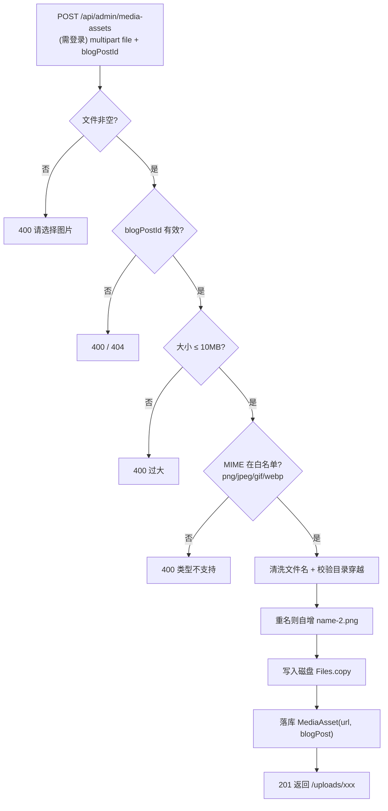

## 1. 开篇：上传一张图，能出多少事

后台写博客要插图，所以要支持图片上传。听起来简单——接收文件、存盘、返回 URL。但「文件上传」是后端公认的高危区，随手一写就能踩中：

- 有人传个 `shell.php` 或 50GB 的文件；
- 文件名叫 `../../etc/passwd`，把文件写出上传目录之外（**目录穿越**）；
- 两次传同名文件，后一个覆盖前一个；
- 数据库记了一条，盘上文件没写成功，或者反过来——上传和文件不一致。

这一章就讲项目里 [MediaAssetService](../../backend/src/main/java/com/guojiaolin/website/media/MediaAssetService.java) 是怎么一个个堵掉这些坑的。

## 2. 上传链路总览



注意第一道门就是 **需要登录**——上传接口在 `/api/admin/**` 下，匿名根本调不到（[第 3 章](03-SpringSecurity会话认证与授权.md)）。这很重要：很多上传漏洞的前提是「匿名可上传」，这里先用授权把入口收窄到只有站主。

## 3. 第一层：类型和大小校验

校验有两道。一道在框架层，[application.yml](../../backend/src/main/resources/application.yml) 限制 multipart 请求体大小，超限的请求在进 Controller 之前就被 Spring 挡掉：

```yaml
spring:
  servlet:
    multipart:
      max-file-size: 10MB
      max-request-size: 10MB
```

另一道在业务层，`MediaAssetService.upload` 显式校验大小和 MIME 类型白名单：

```java
private static final long MAX_IMAGE_SIZE_BYTES = 10L * 1024L * 1024L;
private static final Set<String> ALLOWED_IMAGE_TYPES = Set.of(
  "image/png", "image/jpeg", "image/gif", "image/webp");

if (file.getSize() > MAX_IMAGE_SIZE_BYTES) throw new BadRequestException("Image must be 10MB or smaller.");
var mimeType = StringUtils.hasText(file.getContentType()) ? file.getContentType() : "application/octet-stream";
if (!ALLOWED_IMAGE_TYPES.contains(mimeType)) throw new BadRequestException("Only PNG, JPG, GIF, and WebP images are supported.");
```

用**白名单**（只允许这四种）而不是黑名单（禁止某些类型）——白名单的安全模型更稳，默认拒绝，漏列一种新危险类型也不会出事。

> 要诚实：这里校验的是客户端声明的 `Content-Type`，它是可以被伪造的。真正严格的做法是读文件头的 magic number 来判断真实类型。当前项目是站主自用的后台、入口已经被登录保护，所以接受这个简化——但我知道它的边界在哪。

## 4. 第二层（最关键）：文件名清洗与目录穿越防护

这是上传安全的核心。攻击者可能把文件名构造成 `../../../something`，如果直接 `uploadDir.resolve(fileName)`，文件就被写到上传目录**外面**去了。防护是分层的。

**先清洗文件名**（`sanitizeFileName`）：

```java
private String sanitizeFileName(String originalFileName) {
  var cleaned = StringUtils.cleanPath(StringUtils.hasText(originalFileName) ? originalFileName : "image");
  if (cleaned.contains("..")) throw new BadRequestException("Invalid image file name.");  // 直接拒绝带 .. 的
  var fileName = Path.of(cleaned.replace('\\', '/')).getFileName().toString().trim();      // 只取最后一段文件名
  if (!StringUtils.hasText(fileName)) fileName = "image";
  return fileName
    .replaceAll("[^\\p{IsAlphabetic}\\p{IsDigit}._ -]", "-")  // 只保留字母/数字/. _ 空格 -
    .replaceAll("-{2,}", "-");
}
```

三重处理：① `cleanPath` 规范化路径并显式拒绝含 `..` 的；② `Path.getFileName()` 只取最后一段，把任何目录部分剥掉；③ 用正则把文件名收敛到一个安全字符集，杜绝奇怪字符。

**再在落盘前做最终边界校验**——这是「就算上面都被绕过也兜得住」的最后一道：

```java
var destination = uploadDirectory.resolve(fileName).normalize();
if (!destination.startsWith(uploadDirectory)) {     // 规范化后必须仍在上传目录内
  throw new BadRequestException("Invalid image file name.");
}
try (var input = file.getInputStream()) {
  Files.copy(input, destination);
}
```

`resolve` 后 `normalize`（把 `.`、`..` 算掉），再断言结果路径 `startsWith` 上传目录。**只要最终落点不在上传目录内，一律拒绝**。删除文件时（`deleteFile`）用的是同一套 `normalize + startsWith` 校验，因为删除也是一个能被路径穿越利用的操作。这种「规范化后校验前缀」是防目录穿越的标准姿势。

## 5. 第三层：重名自增，不覆盖

两次传同名文件，不能让后者默默覆盖前者。`resolveAvailableFileName` 在重名时自动加序号：

```java
var candidate = sanitized;     // 如 "photo.png"
var counter = 2;
while (Files.exists(uploadDirectory.resolve(candidate))) {
  candidate = "%s-%d%s".formatted(baseName, counter, extension);  // photo-2.png, photo-3.png ...
  counter += 1;
}
return candidate;
```

它还会在扩展名和 MIME 对不上时，按 MIME 补正确的扩展名（`MIME_EXTENSIONS` 映射），保证存盘文件名的后缀和真实类型一致。

## 6. 一致性与归属：文件、记录、博客三者对齐

上传成功后写一条 [MediaAsset](../../backend/src/main/java/com/guojiaolin/website/media/MediaAsset.java) 记录，并且**绑定到具体某篇博客**：

```java
var asset = new MediaAsset();
asset.setFileName(fileName);
asset.setMimeType(mimeType);
asset.setSizeBytes(file.getSize());
asset.setUrl(toPublicUrl(fileName));   // 生成对外 URL，文件名做 URL 编码
asset.setBlogPost(blogPost);           // 归属：这张图属于哪篇博客
return MediaAssetResponse.from(mediaAssets.save(asset));
```

「图片属于某篇博客」这个约束是迭代出来的——`V4` 迁移（[V4__scope_media_assets_to_blog_posts.sql](../../backend/src/main/resources/db/migration/V4__scope_media_assets_to_blog_posts.sql)）专门把 media 收紧到博客维度。所以上传时强制要 `blogPostId`，没存草稿就传图会被明确拒绝：

```java
if (blogPostId == null) throw new BadRequestException("Please save the blog draft before uploading images.");
```

好处是后台编辑某篇博客时，能精确列出**这篇**的图片（`findAllByBlogPost_Id`），而不是全站图片堆一起。集成测试 `ownerCanUploadAndListMediaAssets` 验证了这个隔离：给博客 A 传的图，查博客 B 时是 0 条。

一致性这块我会主动讲一个**已知局限**：删除时先删物理文件再删数据库记录（`deleteFile` 然后 `mediaAssets.delete`），上传时先写盘再落库。这两步不在一个分布式事务里，理论上存在「写盘成功但落库失败」留下孤儿文件的窗口。对个人站可接受，严格场景要靠对账任务或事务性外发箱来兜。

## 7. 对外服务：把本地目录当静态资源

存下来的图要能通过 `/uploads/xxx.png` 访问。这靠 Spring MVC 的资源处理器把 URL 前缀映射到本地目录（[UploadResourceConfig](../../backend/src/main/java/com/guojiaolin/website/media/UploadResourceConfig.java)）：

```java
@Override
public void addResourceHandlers(ResourceHandlerRegistry registry) {
  var location = uploadDirectory.toUri().toString();
  if (!location.endsWith("/")) location = location + "/";
  registry.addResourceHandler(publicPath + "/**")   // 默认 /uploads/**
          .addResourceLocations(location);           // 指向本地 uploads 目录
}
```

上传目录和公开前缀都来自配置（`site.uploads.directory` / `public-path`），默认 `uploads` 和 `/uploads`。前端 Markdown 引擎里图片地址也会被规范化成 `/uploads/...` 并对每段做 URL 编码（[第 2 章](02-手写Markdown博客引擎.md)的 `toUploadImageSrc`），两边对齐。

这里也有取舍：直接用应用服务静态文件，简单、零额外组件，适合当前规模。但生产上更优的是放对象存储（S3/OSS/MinIO）+ CDN——文件不占应用磁盘、能水平扩展、就近分发。我把上传目录和前缀都做成可配置，就是为以后切换留口子。

## 8. 安全检查清单（这就是我答这道题的提纲）

| 攻击面 | 防护 | 代码位置 |
|---|---|---|
| 匿名上传 | 接口在 `/api/admin/**`，需登录 | SecurityConfig |
| 超大文件 | multipart 限制 + 业务层 10MB 校验 | application.yml / MediaAssetService |
| 危险类型 | MIME 白名单（png/jpeg/gif/webp） | MediaAssetService |
| 目录穿越 | 拒绝 `..` + 只取文件名段 + `normalize`+`startsWith` 兜底 | sanitizeFileName / upload / deleteFile |
| 文件覆盖 | 重名自增 `name-2.png` | resolveAvailableFileName |
| 文件名注入 | 收敛到安全字符集 + URL 编码 | sanitizeFileName / toPublicUrl |
| 越权列举 | media 按博客归属隔离 | findAllByBlogPost_Id |

## 9. 面试口述版

> 项目里的图片上传我是按「每一步对应一个攻击面」来设计的。入口先用授权收窄——上传接口在 `/api/admin/**` 下，匿名调不到。然后是大小和 MIME 白名单校验，框架层和业务层各一道。
>
> 最关键的是目录穿越防护：文件名先 `cleanPath` 并拒绝含 `..` 的，再用 `Path.getFileName()` 只取最后一段把目录部分剥掉，最后落盘前对 `resolve().normalize()` 的结果断言它仍 `startsWith` 上传目录——只要最终落点跑出目录就拒绝，删除操作也用同一套校验。重名会自增序号不覆盖。落库时把图片绑定到具体博客，后台能按博客隔离列举。对外用 Spring 的资源处理器把本地目录映射成 `/uploads/**`。
>
> 我也清楚两个局限：MIME 校验信的是客户端声明的类型、可伪造，严格场景要验 magic number；写盘和落库不在一个事务里，有孤儿文件的窗口。当前是站主自用后台、入口已被登录保护，所以接受这些简化。

## 10. 面试官可能追问的问题

**Q1：目录穿越（path traversal）是什么，你怎么防的？**
攻击者把文件名构造成 `../../etc/passwd` 这种，如果后端直接用它拼路径写文件，就会写到上传目录之外、覆盖系统文件。我防三层：先 `cleanPath` 规范化并直接拒绝含 `..` 的文件名；再用 `Path.getFileName()` 只取最后一段，剥掉所有目录部分；最后落盘前对 `uploadDir.resolve(name).normalize()` 的结果断言 `startsWith(uploadDir)`，跑出目录一律拒绝。最后这道是兜底——就算前面被绕过也拦得住。删除操作也用同样的校验。

**Q2：你用 MIME 类型白名单校验，但 Content-Type 可以伪造，怎么办？**
对，我校验的是客户端声明的 `Content-Type`，确实可伪造。当前项目我接受这个简化，因为入口已经被登录保护、只有站主能传。严格场景的正确做法是读文件头的 magic number 判断真实类型（比如 PNG 头是 `89 50 4E 47`），不信客户端声明。我清楚这个边界，只是按当前威胁模型做了取舍。

**Q3：为什么用白名单不用黑名单？**
白名单是「默认拒绝，只放行已知安全的」，黑名单是「默认放行，只拦已知危险的」。安全上白名单更稳：新出现一种危险类型，黑名单会漏，白名单天然拒绝。所以我只允许 png/jpeg/gif/webp 四种，其余一律拒。

**Q4：上传和数据库记录怎么保证一致？会不会有孤儿文件？**
会有窗口，我不回避。上传是先写盘再落库，删除是先删文件再删记录，这两步不在一个分布式事务里。理论上存在「文件操作成功但数据库操作失败」留下孤儿文件或孤儿记录的可能。对个人站这个概率和影响都很低，可接受。严格场景要靠定时对账任务清理孤儿文件，或者用事务性外发箱/两阶段提交那类机制。

**Q5：重名文件你怎么处理的？**
不覆盖。`resolveAvailableFileName` 先看目标名存不存在，存在就在基础名后加序号，`photo.png` → `photo-2.png` → `photo-3.png`，直到找到一个不冲突的。这样同名上传不会默默覆盖已有文件。

**Q6：直接用应用服务静态文件有什么问题？生产怎么做？**
当前用 Spring 的 `ResourceHandler` 把本地 `uploads` 目录映射成 `/uploads/**`，简单、零额外组件，适合单机小规模。问题是文件占应用磁盘、没法随应用多实例水平扩展、也没有 CDN 就近分发。生产上更好的是放对象存储（S3/OSS/MinIO）+ CDN。我把上传目录和公开前缀都做成了可配置项，就是为以后切到对象存储留的口子。
