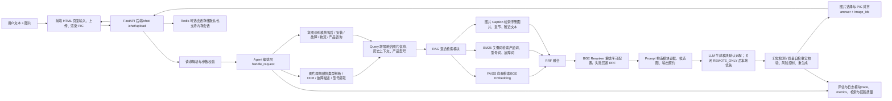
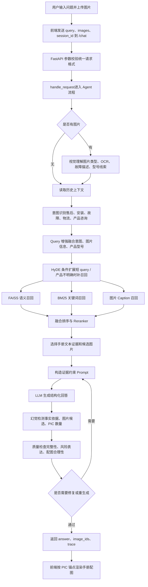

## 1. 项目背景：为什么普通客服机器人不够用

我一开始做这个项目的时候，很快发现一个问题，电商售后客服并不是一个简单的 FAQ 问答场景。

普通 FAQ 的前提是，用户能把问题说清楚，知识库里有一条标准答案，系统只要匹配过去就行。但真实售后里，用户经常只发一句“这个怎么不亮了”，或者直接上传一张故障图。更麻烦的是，问题背后可能同时牵涉产品型号、安装步骤、物流状态、订单截图、故障现象和售后政策。

单轮文本 RAG 也不够。它可以从手册里搜一段文字，但很难判断用户上传的是产品实物图、订单截图，还是一张无关图片；也很难知道某一步需要插入哪张手册配图。产品手册本身不是纯文本，里面有大量图片，回答里如果只给文字，用户可能仍然不知道螺丝该拧在哪里、线该插到哪里、故障灯长什么样。

所以我对这个项目的定位很明确，它不是一个“模型接入 Demo”，也不是“把手册丢进向量库”的练习题。它真正要解决的是一套客服业务链路：用户发来文字和图片后，系统要理解问题、找到证据、选择图片、控制风险，再给出可以被前端渲染的回答。

            这个项目真正要解决的不是“让模型回答”，而是“让模型基于证据、结合图片、按客服流程可靠回答”。

这也是我在架构上最坚持的一点。大模型很强，但客服系统不能只追求“像人在回答”。售后场景里，错误回答会带来真实成本，比如误导用户自行拆机、编造不存在的保修政策、把别的产品说明套到当前产品上。我的设计重点放在证据、约束和闭环上，而不是只把回答写得更顺。

## 2. 输入输出：系统到底处理什么

从工程角度看，这个系统的输入不只是用户的一句话。它接收的是一个多源信息包。

用户侧输入

文本问题、上传图片、会话 ID，以及可能存在的商品型号、订单号、物流信息等结构化字段。

知识侧输入

产品手册文本、手册图片、图片 caption、章节位置和图片 ID 映射关系。

上下文输入

历史会话里已经确认过的产品、型号、问题阶段和用户补充信息。

模型侧输入

检索证据、图片理解结果、意图分类结果、Prompt 约束和候选配图集合。

输出也不是简单的一段自然语言。面向用户，系统要返回结构化客服回答，最好能按步骤告诉用户怎么排查、怎么安装、需要补充什么信息。必要时，回答正文会插入 `<PIC>` ，同时返回对应的 image_ids 。面向系统内部，还会保留检索结果、意图分类结果、质量检查结果和日志信息，方便后续评估。
`<PIC>` 不是普通占位符。它是前端渲染手册配图的锚点，必须和 image_ids 严格一一对应。正文里出现第一个 `<PIC>` ，前端就应该渲染 image_ids[0] 对应的图片；第二个 `<PIC>` ，对应 image_ids[1] 。

这个约束看起来细，但它很重要。因为在安装、故障排查这类场景里，图片不是装饰，而是操作依据。一个错位的图片，比没有图片更危险。

## 3. 总体架构：从前端到后端再到 Agent / RAG

我没有让前端直接调用大模型。前端只负责交互、上传、会话和渲染，真正的业务逻辑全部收敛到 FastAPI 后端。这样做的原因很简单，客服流程里有太多不能暴露给前端的东西，比如模型路由、检索策略、Prompt、幻觉检测、质量检查和日志。把这些逻辑放在后端，系统才可控。

后端也没有把 LLM 当成黑盒。一次请求进入后，会被 Agent 编排层拆成多个阶段：图片理解、意图识别、Query 增强、混合检索、重排序、Prompt 构造、回答生成、幻觉检测、质量自检和图片对齐。RAG 在这里也不是“搜一段文本”这么简单，它同时服务于文本证据、图片证据和回答约束。

Mermaid 架构图

当前项目里已经落地的是 FastAPI 服务、前端 HTML 页面、Agent 编排、FAISS 向量检索、BM25 检索、图片 caption 检索、Reranker 可选接入、Redis 可选会话、日志和评估入口。模型调用默认按 REMOTE_ONLY=1 走远程 OpenAI 兼容接口；如果关闭这个配置，才会进入本地优先、失败回退远程的路径。像 Milvus、MinIO、MongoDB、MySQL 这类组件，我更倾向于把它们放在生产化扩展里讲：Milvus 承接大规模向量库，MinIO 管图片对象存储，MongoDB 存非结构化会话和评估样本，MySQL 存订单、商品、用户等强结构化业务数据。这个区分很重要，因为面试里我不想把“设计预留”说成“已经上线”。

## 4. 一次请求怎么流动：从 /chat 到 handle_request

我把一次请求设计成一个可观察、可拆解、可回退的流程。看起来步骤很多，但每一步都有它存在的理由。

Mermaid 请求流程图

### 第一步，前端只提交事实，不做业务判断

用户在前端输入问题并上传图片后，前端把文本、图片和会话 ID 发到 /chat 。前端不判断“这是不是售后问题”，也不决定要不要检索手册。这样可以减少前端分支，让业务策略集中在后端维护。

### 第二步，FastAPI 负责把入口收干净

FastAPI 先做参数校验和请求整理，然后把统一格式的请求交给 handle_request 。这一步看似普通，但它决定了后面所有模块能不能用同一套数据契约协作。尤其是图片上传、JSON 请求、会话 ID 这些字段，如果入口不统一，Agent 流程后面会非常乱。

### 第三步，Agent 先理解，再检索

我没有让系统一上来就检索。它会先看是否有图片，如果有，就做图片类型判断和信息抽取。订单截图和产品故障图完全不是一回事，前者可能要走物流或售后流程，后者更可能需要结合产品手册排查。然后系统做意图识别，判断用户是在问安装、故障、物流、产品参数，还是复合问题。

### 第四步，RAG 同时找文本证据和图片证据

Query 增强后，系统会先判断是否需要 HyDE：如果问题太短、产品不明确，就让模型补一段“假设手册段落”用于扩展检索 query；否则直接用原检索 query。随后系统同时走 FAISS 语义检索、BM25 关键词检索和图片 caption 检索。这样设计是因为产品手册里有大量相似段落，仅靠语义相似度容易把相近型号或相近步骤混在一起。BM25 可以抓住型号、部件名、故障词；向量检索负责语义扩展；图片 caption 则把手册配图纳入证据链。

### 第五步，生成之后必须检查

LLM 生成回答后，系统不会直接返回。幻觉检测会检查回答是否超出检索证据， image_ids 是否来自候选图片集合，正文中的 `<PIC>` 数量是否和 image_ids 对齐。质量检查会继续看回答是否完整、是否过度承诺、是否把高风险售后结论说得太绝对。必要时会触发修复或有限次数重生成。

## 5. 这个项目最难的点：不是回答，而是有依据地回答

做这个项目时，我最大的感受是，Agent 项目难的地方通常不在“让模型说话”。模型当然会说话，而且说得很像。但客服系统要的是另外一件事：它说的每一句话最好都能回到证据上。

### 难点一：多模态输入不稳定

用户上传的图片可能是产品实物图、故障截图、订单截图、物流截图、安装步骤照片，也可能是一张完全无关的图片。系统不能看到图片就强行回答，更不能把所有图片都当作产品故障图处理。

所以我把图片理解放在 Agent 流程前段。它先判断图片类型，再提取关键信息。比如订单截图更偏向售后和物流，产品实物图更适合抽取型号，故障截图可能要提取屏幕文字或异常状态。这样后面的意图识别和检索 query 才不会从一开始就跑偏。

### 难点二：RAG 检索不能只看语义相似度

产品手册里经常有很多长得很像的段落，比如不同型号的安装说明、相似配件的故障排查步骤、不同语言版本的同类说明。只靠向量相似度，召回结果有时看起来相关，但落到具体产品上就是错的。

我用了混合检索思路：FAISS 负责语义召回，BM25 抓关键词和型号词，HyDE 在问题过短或缺少产品信息时补一段假设性查询文本，Reranker 再对候选 chunk 做精排。图片 caption 也参与召回，因为很多手册图片旁边的文字，正好能说明图片对应的安装步骤或部件位置。

这样做的目的不是堆技术名词，而是提高证据命中率。检索命中率上不去，后面的生成和幻觉治理都会很被动。

### 难点三：PIC 和 image_ids 必须严格对齐

在客服回答里插入图片，不是为了让界面好看，而是为了帮助用户完成安装、排查或确认故障。比如回答里说“请参考下图检查排水管连接位置”，那这张图必须真的是排水管连接图，不能是另一个型号的控制面板图。

所以我没有让模型自由发挥选图，而是把图片 caption、手册章节、检索 chunk 和候选 image_ids 绑定起来。模型只能从候选图片里选择，回答里每出现一个 `<PIC>` ，都必须和返回的 image_ids 对上。这个规则非常“死板”，但客服场景恰恰需要这种死板。

### 难点四：幻觉治理

大模型最危险的地方，是它可以把没有依据的话说得非常像真的。产品规格、保修政策、维修结论、拆机建议，这些内容如果编错了，会直接变成售后风险。

我的做法是把约束分成两层。第一层在 Prompt 里要求模型只能基于检索证据回答，不确定就要求用户补充信息，不允许编造产品规格和售后政策。第二层在生成后做检查，重点看回答是否超出证据、图片是否错配、是否有过度承诺。对高风险结论，系统倾向保守表达，比如建议联系售后，而不是直接给出维修结论。

这个点在面试里很值得讲。因为它能说明我不是只会调 API，而是在把大模型放进一个有边界、有证据、有风险控制的业务流程里。

## 6. 面试可讲亮点：这个项目体现了哪些 Agent 应用开发能力

如果把这个项目放到求职语境里，我不会把它包装成“用了很多 AI 技术”。我会讲它体现了哪些 Agent 应用开发能力。

- 多模态理解能力： 系统能同时处理文字和图片输入，并根据图片类型决定后续流程，而不是把所有图片都丢给模型做一次描述。

- Agent 流程编排能力： 项目不是单 prompt 问答，而是把任务拆成图片理解、意图识别、检索、生成、检查、修复等阶段，每个阶段有清晰职责。

- RAG 工程能力： 检索链路不是单一向量库，而是 FAISS、BM25、图片 caption、HyDE、Reranker 的组合，目标是让证据更准。

- 后端工程能力： 用 FastAPI 承接前端请求，统一请求格式，提供 /chat 、上传、健康检查、指标等接口，把模型能力封装成可调用服务。

- 幻觉治理能力： 通过证据约束、候选图片限制、 `<PIC>` 对齐、质量检查和有限重生成，减少看似合理但无依据的回答。

- 评估闭环能力： 系统保留检索结果、意图分类、回答质量和日志信息，后续可以量化为检索命中率、图片匹配率、回答通过率、重生成率等指标。

- 产品思维： 设计不是为了堆技术，而是围绕真实客服问题展开，比如不完整问题、图片输入、手册依据、售后风险和前端渲染。

我觉得 Agent 应用开发岗位最看重的，往往不是“你知道多少模型名字”，而是你能不能把模型放进真实系统里，让它稳定地解决一个业务问题。这个项目对我来说就是一次完整训练：从需求拆解、架构设计、RAG 检索、后端接口、前端交互，到幻觉治理和评估闭环，都不是孤立模块，而是围绕一个目标工作。

## 7. 最后给一段适合面试中口述的总结

### 面试题：你做过什么 Agent 项目？

1 分钟项目介绍

我做过一个面向电商售后和产品手册问答的多模态客服 Agent。它不是普通的文本问答机器人，用户可以输入问题，也可以上传产品故障图、订单截图、安装截图这类图片。我的主要工作是把这个问题拆成一套完整工程链路：前端负责输入和图片渲染，FastAPI 后端提供 /chat 接口，核心 Agent 负责图片理解、意图识别、Query 增强、RAG 检索、回答生成和质量检查。

RAG 部分我用了混合检索思路，结合 FAISS 语义检索、BM25 关键词检索、图片 caption 和 Reranker，尽量让回答有手册依据。项目里还有一个比较关键的约束是 `<PIC>` 和 image_ids 必须严格对齐，因为前端要根据这个锚点渲染手册配图。整体上，这个项目让我比较完整地实践了 Agent 应用开发，不只是调用模型 API，而是把模型、检索、后端接口、前端交互和幻觉治理串成一个可运行的客服系统。

## 8. 面试官可能追问的问题和参考回答

### 1. 你这个项目和普通 RAG 问答有什么区别？

普通 RAG 更像是“用户问一句，系统检索一段文本，再让模型回答”。这个项目多了几个关键约束：它要处理图片输入，要识别用户意图，要从产品手册里同时找文本证据和图片证据，还要保证回答里的 `<PIC>` 和 image_ids 对齐。也就是说，它不只是问答，而是一个面向客服流程的 Agent 系统。

### 2. 为什么要同时用 FAISS 和 BM25？只用向量检索不行吗？

只用向量检索在很多开放问答里可以工作，但产品手册场景里有大量型号、部件名、故障词，这些词对正确召回非常重要。向量检索擅长语义相似，BM25 更擅长抓精确关键词。我把两者结合起来，是为了减少“语义看起来相关，但产品或步骤不对”的问题。后面再通过 Reranker 精排，提高最终证据质量。

### 3. 你怎么处理用户上传图片？

我没有把图片简单当成一段描述塞给模型，而是先做图片类型判断。它可能是产品图、故障截图、订单截图、物流截图、安装步骤照片，也可能无关。不同类型会影响后续流程，比如订单截图更偏售后和物流，产品图更适合抽型号，故障截图更适合提取异常现象。图片理解结果会参与 Query 增强和意图识别。

### 4. 你怎么降低大模型幻觉？

我主要做了三件事。第一，Prompt 里明确要求只能基于检索证据回答，不确定就让用户补充信息。第二，生成后检查回答是否超出证据，尤其是产品规格、售后政策、维修结论这类高风险内容。第三，图片也做硬约束， image_ids 必须来自检索候选集合， `<PIC>` 数量必须和图片 ID 对齐。必要时会触发修复或有限重生成。

### 5. 如果要生产化，你会怎么扩展这套架构？

当前版本更适合项目验证和中小规模知识库，向量检索主要用 FAISS，图片和手册数据也偏本地化。如果要生产化，我会把向量索引迁到 Milvus 这类向量数据库，把图片放到 MinIO 这类对象存储，把订单、商品、用户这类强结构化数据放到 MySQL，把会话、评估样本、日志这类更灵活的数据放到 Redis 或 MongoDB。这样系统可以支撑更大规模的数据和更清晰的服务边界。
