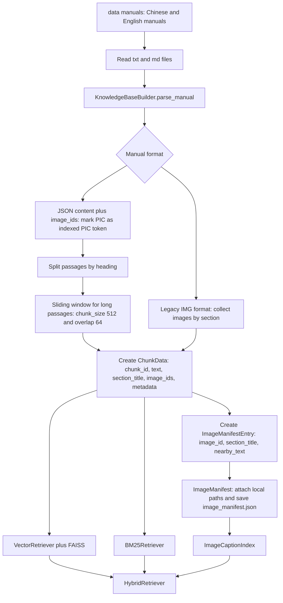
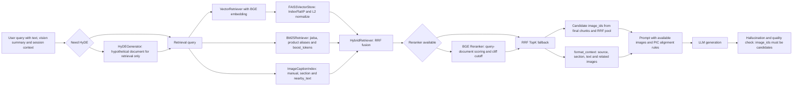

## 1. 开篇：RAG 不是向量库搜索

很多 RAG Demo 的流程都很顺：用户问题，做 embedding，去向量库拿 topK，把结果拼进 Prompt，让 LLM 回答。这个流程能跑，但放到电商售后客服里，很快就会露出问题。

用户不会总是把问题写完整。他可能只说“这个怎么装”“为什么亮红灯”“能退吗”，甚至只上传一张产品图或订单截图。产品手册里又有大量相似章节，语义相似并不等于证据正确。比如“红灯闪烁”和“红灯常亮”可能都很接近，但处理方式完全不一样。

更麻烦的是，这个项目的手册不是纯文本。手册里有 `<PIC>` 占位符，也有对应的 image_ids 。如果回答需要插图，系统不仅要找到文字证据，还要找到正确图片，并且让回答里的 `<PIC>` 顺序和 image_ids 顺序严格对应。

            RAG 的核心不是“向量库搜索”，而是“围绕业务问题构建稳定的证据召回链路”。

所以我在这个客服 Agent 里做 RAG 时，没有把重点放在“怎么查到一段相似文本”上，而是把它当成一个证据召回系统来设计。它要回答三个问题：证据从哪里来，证据怎么排序，证据怎么安全地交给模型使用。

## 2. 知识库格式：手册 JSON、PIC、图片 ID 如何对齐

项目里的知识库不是简单的 txt 文档。源码里由 src/retrieval/knowledge_base_builder.py 的 KnowledgeBaseBuilder 负责解析手册，核心数据结构是 ChunkData 和 ImageManifestEntry 。

当前实现支持两类手册格式。主要格式是 JSON 列表 [content_str, image_ids] ，其中 content_str 里包含 `<PIC>` ，图片 ID 列表按 `<PIC>` 出现顺序一一映射。兼容格式是旧的 Markdown 风格，用 [IMG:xxx] 标记图片。

ChunkData

包含 chunk_id 、 text 、 manual_name 、 section_title 、 image_ids 、 pic_count 、 metadata 等字段。

ImageManifestEntry

记录 image_id 、 manual_name 、 section_title 、 nearby_text 和 order_in_manual ，用于图片候选和 prompt 注入。

这里最关键的是 `<PIC>` 。它不是普通文本，而是模型回答和前端图片渲染之间的锚点。正文里出现第一个 `<PIC>` ，后端返回的第一个 image_id 就应该被渲染到这个位置。这个约束如果不在知识库阶段就处理好，后面再靠模型猜，很容易出错。

源码里的做法是先把每个 `<PIC>` 替换成带序号的
 ，切 chunk 的时候保留这个序号。等 chunk 生成后，再把
 还原成 `<PIC>` ，并通过序号反查对应的 image_id 。这一步解决了一个很实际的问题：哪怕中间做了滑动窗口，图片顺序也不会丢。

简化知识库示例，不是源码完整字段
```
{
  "manual_name": "中文手册/可编程温控器手册",
  "section_title": "安装说明 > 固定底座",
  "text": "将底座对准主机卡槽后向下压紧。<PIC>",
  "image_ids": ["thermostat_01"],
  "pic_count": 1,
  "metadata": {
    "source": "中文手册/可编程温控器手册",
    "section": "固定底座",
    "chunk_index": 3,
    "indexed_pic_indices": [0]
  }
}
```

Mermaid 知识库构建流程图


中文伪代码图：逐节点解释 Mermaid 知识库构建流程

输入与读取
A / B / C

从 `data/manuals` 扫描中文手册和英文手册，只处理 `.txt`、`.md` 这类手册文件。每读到一本手册，就交给 `KnowledgeBaseBuilder.parse_manual` 解析，而不是直接整篇塞进向量库。

得到：manual_name、raw_text

↓

格式分流
D
`Manual format` 是一个分支判断：如果手册是 JSON 列表，就走 `content + image_ids` 路线；如果是旧格式，就走 `IMG` 标记路线。这里先把两种输入格式统一成后面可处理的“正文 + 图片信息”。

决定：JSON 路径或旧格式路径

↓

JSON 路径
E

JSON 手册里正文有 `<PIC>`，旁边有按顺序排列的 `image_ids`。系统先把每个 `<PIC>` 临时改成带编号的图片 token，比如第 0 张、第 1 张、第 2 张，这样后面切 chunk 时仍能知道每个图片占位符对应哪个 image_id。

解决：PIC 和 image_ids 不错位

↓

旧格式路径
F

旧格式手册没有 JSON 图片列表，而是在章节里出现 `IMG` 标记。系统会按章节收集这些图片，把图片和所在章节、附近文字先绑定起来，再合并到后续 chunk 构建流程。

得到：章节级图片信息

↓

按标题切段
G

对解析后的正文先按标题、章节结构切成 passage。这样每个候选文本块天然带有章节语义，比如“安装说明”“故障排查”“参数配置”，后面回答时也能追溯来源。

得到：passages + section_title

↓

滑窗切 chunk
H

如果某个 passage 太长，就用滑动窗口继续切分，例如 `chunk_size = 512`、`overlap = 64`。overlap 的作用是保留前后文，避免把“问题现象”和“解决方法”切散；同时要尽量避免切断图片 token。

得到：可检索的文本块

↓

创建 ChunkData
I

每个 chunk 会被封装成 `ChunkData`，字段包括 `chunk_id`、正文 `text`、章节 `section_title`、绑定图片 `image_ids` 和 `metadata`。如果 chunk 中出现了编号后的图片 token，就反查原始 image_id 并写入 `ChunkData.image_ids`。

得到：chunk ↔ 图片 ↔ 来源章节

↓

创建图片清单
J / K

再为每张手册图创建 `ImageManifestEntry`，记录 `image_id`、所属手册、章节标题、附近文本 `nearby_text` 和本地图片路径。最后保存成 `image_manifest.json`，后面图片召回和前端渲染都依赖它。

得到：image_id ↔ path ↔ nearby_text

↓

建三路索引
L / M / N
`ChunkData` 会进入两条文本索引：一条是 `VectorRetriever + FAISS`，用于语义召回；另一条是 `BM25Retriever`，用于型号、错误码、按钮名等关键词召回。`ImageManifest` 会进入 `ImageCaptionIndex`，用于图片 caption 和附近文字召回。

得到：向量召回 + 关键词召回 + 图片召回

↓

组装混合检索
O

最后把 `VectorRetriever`、`BM25Retriever`、`ImageCaptionIndex` 汇入 `HybridRetriever`。在线请求进来时，系统就可以同时拿到文本证据、关键词证据和候选图片，而不是只靠单一路径。

用于：RAG 召回链路

把上面的 Mermaid 翻译成函数伪代码
```
def build_knowledge_base(manuals_dir, images_dir):
    all_chunks = []
    image_manifest = []

    # A / B / C: 读取手册，并交给 KnowledgeBaseBuilder.parse_manual
    for file in scan_files(manuals_dir, suffixes=[".txt", ".md"]):
        raw_text = read_text(file)
        manual_name = get_manual_name(file)

        # D: 判断手册格式
        if is_json_manual(raw_text):
            # E: JSON 手册：content 里有 PIC，image_ids 按 PIC 顺序排列
            content, image_ids = parse_json_manual(raw_text)
            indexed_text = replace_pic_with_indexed_token(content)
        else:
            # F: 旧格式：按章节收集 IMG 标记
            indexed_text, image_ids = parse_legacy_img_manual(raw_text)

        # G / H: 先按标题切 passage；太长时再滑窗切 chunk
        passages = split_passages_by_heading(indexed_text)
        raw_chunks = []
        for passage in passages:
            if too_long(passage):
                raw_chunks.extend(sliding_window(passage, size=512, overlap=64))
            else:
                raw_chunks.append(passage)

        # I: 创建 ChunkData，并把 chunk 内 PIC 反查成 image_ids
        for chunk_text in raw_chunks:
            bound_image_ids = map_pic_tokens_to_image_ids(chunk_text, image_ids)
            chunk = ChunkData(
                chunk_id=make_chunk_id(manual_name, chunk_text),
                text=restore_pic_token(chunk_text),
                section_title=get_section_title(chunk_text),
                image_ids=bound_image_ids,
                metadata={"manual_name": manual_name},
            )
            all_chunks.append(chunk)

            # J: 为 chunk 相关图片创建 ImageManifestEntry
            for image_id in bound_image_ids:
                image_manifest.append(ImageManifestEntry(
                    image_id=image_id,
                    manual_name=manual_name,
                    section_title=chunk.section_title,
                    nearby_text=extract_nearby_text(chunk.text, image_id),
                ))

    # K: 补本地图片路径，并保存 image_manifest.json
    attach_local_image_paths(image_manifest, images_dir)
    save_json("image_manifest.json", image_manifest)

    # L / M / N: 建三路索引
    vector_retriever = build_vector_retriever_with_faiss(all_chunks)
    bm25_retriever = build_bm25_retriever(all_chunks)
    image_caption_index = build_image_caption_index(image_manifest)

    # O: 组装 HybridRetriever，供在线 RAG 使用
    return HybridRetriever(
        vector_retriever=vector_retriever,
        bm25_retriever=bm25_retriever,
        image_caption_index=image_caption_index,
    )
```

## 3. Chunk 策略：不是随便切 500 字，而是按章节、语义和图片绑定切

chunk 策略在这个项目里非常关键。客服手册不是普通文章，一个安装步骤可能依赖前后步骤，一个故障说明可能同时包含现象、原因和解决方法。图片通常又只对应某个局部步骤。如果切分破坏了文字和 `<PIC>` 的关系，后续图片召回就会错位。

当前实现的策略比较务实：先按手册标题切成 passage，再把短 passage 装箱到 512 字符左右的 chunk，过长 passage 用滑动窗口切分，overlap 是 64。每个 chunk 都带上 manual_name 、 section_title 、 product_keywords 和 metadata 。如果 chunk 里有 `<PIC>` ，就绑定对应的 image_ids ，并记录 pic_count 。

我这么设计，是因为面试官会关心一个问题：你是不是只知道“chunk 大小影响召回”，还是知道业务里 chunk 到底会影响什么。在这个项目里，chunk 影响的不只是召回文本，还影响配图、证据来源和最终回答能不能渲染。

关键伪代码：chunk 构建逻辑
```
def build_chunks(manual_text, image_ids, manual_name):
    indexed = replace_pic_with_global_index(manual_text)  # <PIC> -> <PIC_N>
    passages = split_by_heading(indexed)
    raw_chunks = []

    for passage in passages:
        if len(passage.text) > MAX_CHUNK_SIZE:
            raw_chunks.extend(
                sliding_window(
                    passage.text,
                    size=MAX_CHUNK_SIZE,
                    overlap=CHUNK_OVERLAP,
                    avoid_cutting_pic_token=True
                )
            )
        else:
            raw_chunks.append(pack_with_neighbor_passages(passage))

    chunks = []
    for raw in raw_chunks:
        pic_indices = find_pic_indices(raw.text)
        related_images = [image_ids[i] for i in pic_indices if i < len(image_ids)]
        chunks.append(create_chunk(raw, related_images))

    return chunks
```

这段伪代码背后的思路很简单：先保护图片位置，再谈文本切分。因为一旦 `<PIC>` 和 image_id 的关系在入库时丢掉，后面再做 RRF、Reranker、Prompt 都救不回来。

## 4. 向量检索：BGE Embedding + FAISS 解决语义召回

向量检索在这个项目里解决的是“用户说法和手册说法不一样”的问题。比如用户说“机器一直闪红灯”，手册写的是“状态指示灯红色闪烁表示设备异常”。关键词不完全一致，但语义上是在问同一类故障。

当前实现里， VectorRetriever.index 会对 ChunkData.text 做 embedding，然后写入 FAISSVectorStore 。而 ChunkData.text 在构建时已经把章节标题拼到了正文前面，所以向量检索不只看到正文，也能看到 section_title 带来的上下文。

FAISSVectorStore 使用 faiss.IndexFlatIP ，写入和查询时都会做 L2 normalize，所以内积可以近似作为余弦相似度。它负责的是快速查向量相似的 chunk，不负责判断这个 chunk 是否真能回答问题。

当前实现里，图片 caption 没有简单地塞进每个 chunk 的 embedding 文本，而是通过 ImageCaptionIndex 单独参与召回。后续如果要增强向量召回，可以把 title_path / 正文 / caption / 产品名 / 故障词 组合成更丰富的 embedding text。

可扩展的 embedding text 示例
```
产品：可编程温控器
章节：故障排查 > 显示与指示灯异常
正文：状态指示灯红色闪烁表示设备异常，请检查电源、接线和传感器状态。
图片说明：红色指示灯闪烁示意图
```

我不会把 FAISS 说成 RAG 的全部。FAISS 解决的是“怎么快速查相似向量”，不是“证据是否正确”。这就是为什么后面还要有 BM25、图片 caption 召回、RRF 融合和可选 Reranker。

## 5. 关键词检索：jieba + BM25 解决精确匹配和型号问题

在客服场景里，很多关键信息必须精确匹配。产品型号、错误码、配件名称、按钮名称、指示灯颜色、售后政策关键词，这些东西一旦错了，回答就会直接跑偏。

举个例子，用户问“E03 报错怎么处理”。向量检索可能召回“设备异常”相关段落，但真正需要的是包含 E03 的故障码说明。这个时候 BM25 比向量检索更靠谱，因为它更关心 query 里的词有没有真实出现在文档里。

当前代码里的 BM25Retriever 是手写 BM25 实现，中文场景用 jieba 分词，并通过 product_alias 把产品别名注册到 jieba 用户词典里。它还支持 manual_whitelist 硬过滤、 product_filter 软过滤和 boost_tokens 加权，适合处理产品名、型号、错误码这类强约束词。

关键伪代码：BM25 召回
```
def bm25_retrieve(query, chunks, boost_tokens=None):
    tokenized_query = jieba_cut(query)
    scores = []

    for chunk in chunks:
        doc_tokens = tokenize(chunk.text)
        score = bm25_score(tokenized_query, doc_tokens)

        if hit_boost_tokens(doc_tokens, boost_tokens):
            score *= BOOST_FACTOR

        scores.append((chunk, score))

    return top_k_positive_scores(scores)
```

它和向量检索是互补关系。向量检索负责同义表达和口语化问题，BM25 负责精确词项、型号和错误码。只用其中一个都会有盲区。

## 6. 融合排序：RRF 不是简单加权，而是降低单一路径误判

FAISS 和 BM25 的 score 分布不一样，不能直接拿两个分数相加。向量相似度可能是 0.6、0.7，BM25 可能是 3、10、20，直接加权很容易被某一路分数尺度带偏。

项目里的 HybridRetriever 用 RRF 思路融合结果。通俗讲，它不直接比较原始分数，而是看一个 chunk 在多个召回列表里的排名。如果一个 chunk 同时在向量检索和 BM25 里都排得靠前，它更可能是真正相关的证据。

RRF 公式
```
RRF_score(d) = Σ 1 / (k + rank_i(d))
```

当前代码里还保留了 vector_weight 和 bm25_weight ，默认向量 0.6、BM25 0.4；RRF 平滑常量 rrf_k 是 60。图片 caption 命中的 chunk 也会以额外权重注入 RRF 分数。

关键伪代码：FAISS + BM25 + Caption 的 RRF 融合
```
def rrf_fusion(vector_results, bm25_results, caption_hits, k=60):
    scores = defaultdict(float)
    chunk_map = {}

    for rank, chunk in enumerate(vector_results, start=1):
        scores[chunk.id] += 0.6 * (1 / (k + rank))
        chunk_map[chunk.id] = chunk

    for rank, chunk in enumerate(bm25_results, start=1):
        scores[chunk.id] += 0.4 * (1 / (k + rank))
        chunk_map[chunk.id] = chunk

    for rank, image_id in enumerate(caption_hits, start=1):
        for chunk_id in image_to_chunk_ids[image_id]:
            scores[chunk_id] += 0.2 * (1 / (k + rank))

    return sort_by_score(scores, chunk_map)
```

这个设计解决的不是“排序公式好不好看”，而是降低单一路径误判。向量检索可能错召相似章节，BM25 可能漏召同义表达，RRF 可以让多路都认可的证据更稳定地进入下一阶段。

## 7. 可选 BGE Reranker：从“召回候选”到“精排证据”

Reranker 的位置是在 FAISS、BM25、图片 caption 和 RRF 之后。它不负责全库召回，而是对融合后的少量候选 chunk 做更细的 query-document 匹配。

当前项目里有 src/retrieval/reranker.py ，默认模型名是 BAAI/bge-reranker-v2-m3 ，通过 FlagEmbedding 懒加载。在线服务的运行时配置里 RERANK_ENABLED 默认偏开启，但 config.yaml 示例里写的是关闭，最终以环境变量和实际启动配置为准。它有一个很工程化的处理：如果没有安装 FlagEmbedding ，或者模型加载失败，就回退到 RRF 顺序，不让主流程崩掉。

这个取舍很重要。Reranker 通常比 embedding 检索慢，所以不应该对全库跑。它适合处理 topK 候选，比如先让 FAISS 召回 topK1，BM25 召回 topK2，RRF 融合得到 topK3，再由 Reranker 精排，最后交给 Prompt。

面试里我会如实说：Reranker 是项目里的可配置增强模块。代码已预留并接入 HybridRetriever ，运行时默认值、配置文件示例和部署环境可能不一样；实际效果取决于环境里是否安装了 FlagEmbedding ，以及 RERANK_ENABLED / rerank_enabled 的最终取值。

## 8. 图片召回：image manifest + caption index 怎么工作

图片召回是这个多模态客服 Agent 和普通文本 RAG 最大的差异之一。图片不能交给模型自由决定，因为模型不知道前端实际有哪些图片，可能编造 image_id ，也可能把不相关图片插进回答。

项目里有一张图片资产表，也就是 ImageManifest 。它来自 KnowledgeBaseBuilder.consume_image_manifest() ，记录每张图来自哪本手册、哪个章节、附近文本是什么、在手册里是第几张。 ImageManifest.captions_for 会把 nearby_text 或章节标题渲染成简短 caption，供 Prompt 使用。

另外， ImageCaptionIndex 会把 manual_name 、 section_title 、 nearby_text 和可选的额外 caption 拼成图片检索文本，用 BM25 建索引。这样当用户问“底座怎么装”“红灯闪烁是什么样子”“滤芯在哪里”时，系统不仅能召回文字 chunk，也能通过图片 caption 找到相关 image_id ，再映射回对应 chunk。

Mermaid 检索链路图

这张链路图较长，已放大画布；可以左右拖动底部滚动条查看完整流程。


中文伪代码图：逐节点解释 Mermaid 检索链路

输入节点
Q

图里的 `User query with text, vision summary and session context` 不是原始问题，而是把用户文本、图片理解结果、会话里的商品型号和上一轮上下文先合并。这样“怎么安装”“红灯闪”这类短问题，才能变成可检索的问题。

解决：用户说得不完整

↓

HyDE 开关
H / HY / Q2
`Need HyDE` 是条件判断，不是每次都走。只有 query 太短、产品名缺失、召回分数偏低时，才让 `HyDEGenerator` 生成一段“假想手册段落”，再和原 query 合并成 `Retrieval query`。它只帮检索扩写，不作为最终回答依据。

解决：短 query 召回不稳

↓

三路召回
V / B / C

这一步对应图里的三路并行：第一路 `VectorRetriever with BGE embedding` 把 `Retrieval query` 编码成语义向量，再交给 `FAISSVectorStore` 找语义相近的手册 chunk；第二路 `BM25Retriever` 用 jieba、型号别名、boost_tokens 抓型号、错误码、按钮名；第三路 `ImageCaptionIndex` 按图片 caption、章节、附近文字找相关手册配图。

得到：语义候选 + 关键词候选 + 图片候选

↓

融合排序
R
`HybridRetriever: RRF fusion` 把向量召回、BM25 召回和图片 caption 召回的候选合并。RRF 不比较原始分数，因为 FAISS 分数、BM25 分数、caption 分数尺度不同；它看的是“同一个 chunk 在各路结果里的排名”。多路都靠前的 chunk，会被排到更前面。

解决：分数尺度不一致

↓

精排或回退
RR / BR / TOP
`Reranker available` 判断 BGE Reranker 是否可用。可用时，只对 RRF 后的小候选集做 query-document 精排和截断；不可用时，直接走 `RRF TopK fallback`。这个设计保证模型服务失败时，检索链路仍能返回可用证据。

解决：精度和稳定性平衡

↓

拆成两类证据
IMG / CTX
`TOP` 之后会分成两条输出：一条收集 `Candidate image_ids`，作为候选图池；另一条调用 `format_context`，把来源手册、章节标题、正文、关联图片整理成文本证据。也就是说，图和文字都来自检索结果，不交给 LLM 自由发挥。

解决：图片不能乱配

↓

生成与校验
P / L / G
`Prompt` 同时拿到文本证据和候选图池，并写明：需要插图时才能输出 `<PIC>`，且 image_ids 必须来自候选集合。LLM 生成后，幻觉检测和质量检查会再验证事实是否有依据、图片数量是否和 `<PIC>` 对齐。

解决：有依据地回答

把上面的 Mermaid 翻译成函数伪代码
```
def rag_retrieve(user_query, vision_summary, session_context):
    # 1. 先补全问题：原始 query 太短，直接检索容易找错手册
    retrieval_query = build_retrieval_query(
        text=user_query,
        vision=vision_summary,
        session=session_context,
    )

    # 2. HyDE 是检索增强，不是事实来源
    if need_hyde(retrieval_query):
        hyde_doc = generate_hypothetical_manual_text(retrieval_query)
        if hyde_doc:
            retrieval_query = merge_query_and_hyde(retrieval_query, hyde_doc)

    # 3. 三路召回：语义向量、关键词、图片 caption 同时找候选
    #    第一路：VectorRetriever 先用 BGE 把 query 变成语义向量
    #    再交给 FAISSVectorStore，查语义最接近的手册 chunk
    query_vector = bge_embedding_model.encode(retrieval_query, normalize=True)
    vector_hits = faiss_vector_store.search(query_vector, top_k=30)

    #    第二路：BM25 精确找型号、错误码、按钮名
    bm25_hits = bm25_search_with_alias_and_boost(retrieval_query)

    #    第三路：ImageCaptionIndex 找相关手册配图
    caption_hits = image_caption_search(retrieval_query)

    # 4. RRF 融合：不硬加不同检索器的分数，只看排名贡献
    rrf_pool = rrf_fusion(
        vector_hits=vector_hits,
        bm25_hits=bm25_hits,
        caption_hits=caption_hits,
    )

    # 5. 有 reranker 就精排；没有就用 RRF TopK 兜底
    if reranker_available():
        final_chunks = bge_rerank_and_cutoff(retrieval_query, rrf_pool)
    else:
        final_chunks = take_top_k(rrf_pool)

    # 6. 最终证据拆成“文本上下文”和“候选图池”
    context_text = format_context(final_chunks)
    candidate_image_ids = collect_image_ids(final_chunks, rrf_pool)

    # 7. LLM 只能在这些证据里回答，图片也只能从候选图池选
    answer = llm_generate(
        query=user_query,
        evidence=context_text,
        available_image_ids=candidate_image_ids,
        pic_rule="如果输出 <PIC>，image_ids 必须同数量、同顺序、来自候选图池",
    )

    return hallucination_and_quality_check(answer, candidate_image_ids)
```

图片召回实际有两条路径。第一条是文本 chunk 自带 image_ids ，最终证据 chunk 如果有图，优先用这些绑定图片。第二条是 caption 独立召回图片，再通过 image_to_chunk_ids 把图片映射回 chunk，为 RRF 增加权重或注入候选。

关键伪代码：图片选择
```
def select_images(final_chunks, rrf_chunks, query):
    selected = []

    for chunk in final_chunks:
        selected.extend(chunk.image_ids)

    if need_more_visual_help(query):
        caption_hits = caption_retrieve(query)
        for image_id in caption_hits:
            chunk_ids = image_to_chunk_ids[image_id]
            if section_is_consistent(chunk_ids, final_chunks):
                selected.append(image_id)

    return deduplicate_keep_order(selected)
```

最终原则是：图片必须和最终证据 chunk 同章节或相邻上下文相关， image_ids 不能由 LLM 编造， `<PIC>` 出现顺序必须和 image_ids 顺序一致。不确定时宁可不插图，也不要插错图。

## 9. HyDE：短 query 或产品不明确时怎么补召回

HyDE 的全称是 Hypothetical Document Embeddings。它不是直接回答用户，而是先让模型生成一段“假想手册段落”，再把这段文本和原 query 拼在一起去检索。

在客服场景里，短 query 很常见，比如“怎么装”“红灯怎么回事”“一直响怎么办”。这种 query 信息太少，直接做 embedding 可能不稳定。项目里的 HyDEGenerator.should_run 会在 query 过短、产品名为空或主路分数低时触发。失败或超时会返回 None，不影响原始 query 继续检索。

关键伪代码：HyDE 补召回
```
def maybe_use_hyde(query, item_names, first_pass_score):
    if is_short(query) or not item_names or low_confidence(first_pass_score):
        hypothetical_doc = generate_hyde_doc(query)
        if hypothetical_doc:
            return query + "\n\n" + hypothetical_doc

    return query
```

HyDE 的坑也很明显：它生成的是检索辅助文本，不是事实。最终回答不能引用 HyDE 内容，仍然必须基于真实召回的手册 chunk。这个边界如果讲不清，面试官很容易追问“HyDE 会不会引入幻觉”。

## 10. 最终证据组装：把检索结果变成 LLM 能用的上下文

RAG 检索不是结束。真正交给 LLM 前，还要把证据整理成模型能理解、也能被规则检查的上下文。

当前项目里 HybridRetriever.format_context 会把每个 chunk 渲染成“来源手册 > 章节 + 正文 + 关联图片”的格式。Agent 在生成阶段还会把用户问题、图片理解结果、子问题、候选 image_ids 、会话上下文和额外约束一起交给 Prompt。

简化 Prompt 结构
```
你是一个客服助手，请严格基于【检索证据】回答用户问题。

【用户问题】
{user_query}

【图片理解结果】
{vision_summary}

【检索证据】
{retrieved_chunks}

【可用图片】
{image_candidates}

【回答要求】
1. 只能使用检索证据中的信息。
2. 不要编造产品规格、售后政策和维修结论。
3. 如果证据不足，请说明需要用户补充哪些信息。
4. 如需插入图片，只能使用可用图片中的 image_id。
5. <PIC> 的数量必须和返回的 image_ids 数量一致。
```

这一步是幻觉治理的关键。LLM 不能看到整本手册，只能看到检索出来的证据；它也不能自由生成图片 ID，只能从候选集合里选。换句话说，Prompt 不是为了让模型“更会说”，而是为了让模型在证据边界内说。

## 11. 评估闭环：怎么判断 RAG 检索链路好不好

RAG 优化不能靠感觉。这个项目里我会把问题拆成“召回问题、排序问题、Prompt 问题、生成问题”几类，再用日志和测试集定位。

检索指标

Recall@K、MRR、Hit Rate、目标章节命中率、图片命中率、chunk-source 一致性。

生成指标

回答是否基于证据、是否编造手册没有的信息、 `<PIC>` 和 image_ids 是否对齐。

日志字段

user_query 、HyDE query、vector hits、BM25 hits、RRF score、reranker score、final chunks、final image_ids、latency。

排障价值

如果答案错了，可以判断是没召回、排错序、证据不足，还是模型生成时越界。

当前项目里已经有 RequestTrace 、 MetricsCollector 、评估脚本和输出文件目录，后续可以把这些指标系统化。面试里我不会说“准确率提升 xx%”，因为没有严谨实验就不该编数据。我会说这套链路可以通过这些指标持续评估和迭代。

## 12. 总结：RAG 的核心是召回证据，不是让模型自由发挥

在这个客服 Agent 里，我对 RAG 的理解是：向量库只是其中一环，chunk 策略决定知识能不能被正确召回，BM25 解决精确匹配，RRF 降低单一路径误判，Reranker 提升最终证据质量，HyDE 用于短 query 补召回，caption index 让图片也能被检索， `<PIC>` 和 image_ids 对齐保证前端可渲染。

            我在这个项目里做 RAG，不是把文档切块丢进向量库，而是把它当成一个证据召回系统来设计：先保证知识库结构化，再通过向量检索、关键词检索、融合排序和图片绑定，把可追溯的文本证据和图片证据交给模型，最后通过 Prompt 约束和质量检查减少幻觉。

## 13. 面试口述版

### 面试题：你这个项目里的 RAG 是怎么做的？

我这个项目里的 RAG 不是单纯把文档切块后丢进向量库。因为它是电商售后和产品手册问答场景，用户问题经常很短，还可能上传图片，所以我把 RAG 设计成一套证据召回链路。

入库阶段，我用 KnowledgeBaseBuilder 解析手册，把正文里的 `<PIC>` 和 image_ids 按顺序绑定，生成 ChunkData 和图片 manifest。检索阶段同时走 FAISS 语义检索和 jieba + BM25 关键词检索，再用 RRF 融合结果；如果 query 很短或者产品不明确，会用 HyDE 做补召回；Reranker 作为可选增强，对融合后的少量候选做精排。图片这块还有 ImageCaptionIndex ，会把图片所属章节和 nearby_text 变成可检索的 caption。

最后交给模型的不是一堆随便拼的文本，而是带来源、章节、候选图片和输出约束的证据上下文。回答里如果出现 `<PIC>` ，返回的 image_ids 必须严格对应。这样做的目的就是让模型基于证据回答，而不是自由发挥。

## 14. 面试官可能追问的问题和参考回答

### 1. 为什么不能只用向量检索？

因为客服手册里很多信息需要精确匹配，比如型号、错误码、按钮名称和指示灯颜色。向量检索擅长语义相似，但相似不代表证据正确。比如“红灯闪烁”和“红灯常亮”语义接近，但处理方式可能不同。所以我用 FAISS 做语义召回，再用 BM25 抓精确词，最后通过 RRF 融合，降低单一路径误判。

### 2. chunk size 怎么定？

我不是单纯按固定字数硬切。项目里优先按手册标题切 passage，短 passage 会装箱，过长 passage 才用滑动窗口。当前实现里 chunk_size 是 512，overlap 是 64。这个大小主要是为了平衡召回粒度和上下文完整性，同时避免切断
 ，保证图片和正文关系不丢。

### 3. 图片和文本怎么绑定？

手册格式里正文有 `<PIC>` ，后面有 image_ids 列表。解析时我先把 `<PIC>` 变成
 ，N 是图片全局顺序。切 chunk 后再根据 N 反查 image_id，并写入 ChunkData.image_ids 。同时生成 ImageManifestEntry ，记录图片所属手册、章节和附近文本。

### 4. BM25 和向量检索结果怎么融合？

项目里通过 HybridRetriever 融合。它先分别拿到 FAISS 结果和 BM25 结果，再用 RRF 按排名融合，而不是直接把原始分数相加。代码里还保留了 vector_weight 和 bm25_weight，默认向量召回权重更高一点，同时 caption index 的图片命中也可以给相关 chunk 加权。

### 5. RRF 为什么比直接加权更稳？

因为不同检索器的分数尺度不一样。向量相似度和 BM25 分数不能直接比较，强行相加容易被某一路带偏。RRF 看的是排名，一个 chunk 如果在向量检索和 BM25 里都靠前，它就更值得进入下一阶段。这样能降低单一路径误召的影响，也更适合多路召回融合。

### 6. HyDE 会不会引入幻觉？

会有风险，所以我把 HyDE 定位成检索辅助，而不是事实来源。它生成的假设文档只用于扩展 query，提高短问题的召回稳定性，最终回答不能引用 HyDE 内容。回答仍然必须基于真实召回的手册 chunk。代码里 HyDE 失败或超时会直接跳过，不会阻塞主流程。

### 7. Reranker 放在哪一层？为什么不直接全库 rerank？

Reranker 放在 FAISS、BM25、caption index 和 RRF 之后。它适合对融合后的少量候选做精排，不适合全库跑，因为 query-document pair 打分成本更高。当前实现里 Reranker 是懒加载的可配置增强模块，如果模型不可用，会回退到 RRF 顺序，保证服务可用。

### 8. 怎么评估 RAG 的效果？

我会分检索和生成两层看。检索层看 Recall@K、MRR、目标章节命中率、图片命中率；生成层看回答是否基于证据、是否编造手册不存在的信息、 `<PIC>` 和 image_ids 是否对齐。日志里要记录 query、各路 hits、RRF 分数、reranker 分数、final chunks 和最终回答，这样才能定位问题在哪一层。

### 9. PIC 和 image_ids 怎么防止错位？

第一步是在入库阶段绑定， `<PIC>` 按顺序映射到 image_ids。第二步是在生成阶段只把候选 image_ids 提供给模型，不允许模型自由编。第三步是在幻觉检查里做硬校验，正文中的 `<PIC>` 数量必须和返回的 image_ids 长度一致，而且 image_ids 必须来自候选集合。

### 10. 如果召回不到正确文档怎么办？

我会先看问题出在哪层。如果 query 太短或缺产品名，可以用 HyDE 或会话上下文补召回；如果是型号、错误码没命中，就加强 BM25 分词、产品别名和 boost_tokens；如果召回到了但排序靠后，就看 RRF 权重或 Reranker。仍然证据不足时，系统应该追问用户补充型号或故障信息，而不是让模型硬答。

## 15. 3 条可以放进简历的项目亮点描述

- 设计并实现多模态客服 Agent 的 RAG 证据召回链路，基于 KnowledgeBaseBuilder 将产品手册解析为带章节、图片绑定和元数据的 ChunkData ，保证 `<PIC>` 与 image_ids 可追溯对齐。

- 构建 FAISS 语义检索、jieba + BM25 关键词检索、图片 caption 检索和 RRF 融合排序流程，并接入可选 BGE Reranker 与 HyDE 补召回，提高短 query、型号词和图文证据场景下的召回稳定性。

- 围绕客服风险设计证据约束和评估闭环，记录检索候选、最终 chunk、候选图片、生成结果和质量检查信息，为 Recall@K、MRR、图片命中率、 `<PIC>` 对齐率等指标评估预留数据基础。
