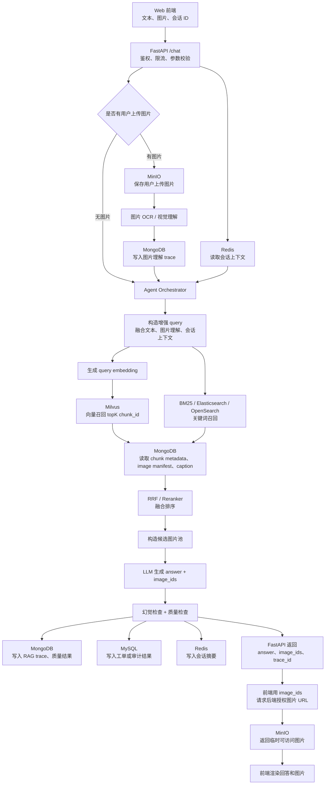
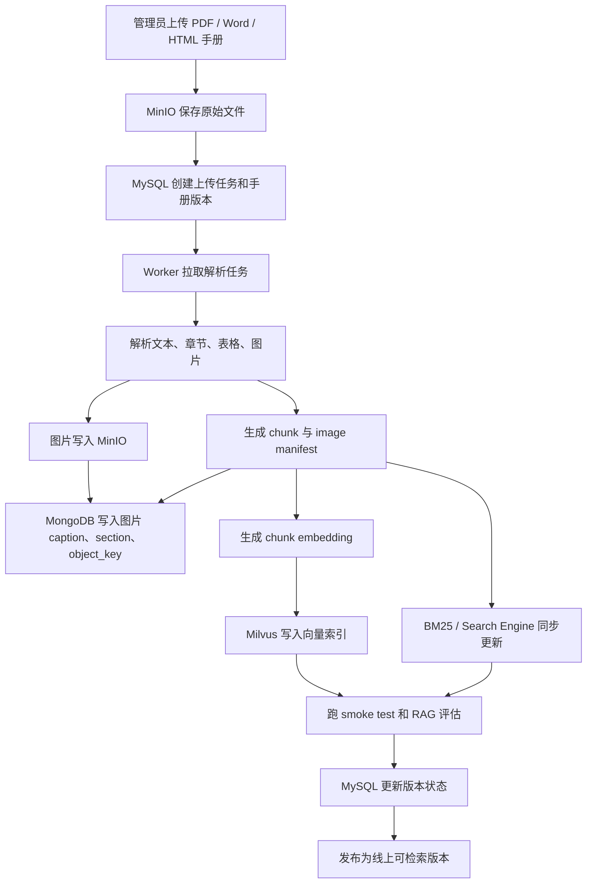

## 1. 开篇：一个能跑的 RAG Agent，不等于一个生产级 RAG Agent

我当前这个项目已经能跑通一条完整链路：用户输入问题或上传图片，前端把请求交给 FastAPI，后端调用 MultiModalCustomerServiceAgent.handle_request ，Agent 完成图片理解、query 增强、意图判断、RAG 检索、LLM 生成、幻觉检查和质量检查，最后返回 answer 与 image_ids 给前端。

但我不会把它说成已经是生产级系统。更准确的说法是：当前版本先把「Agent + RAG + 多模态 + `<PIC>` 对齐 + 幻觉治理 + 评估闭环」跑通了，适合本地开发、演示、求职项目和小规模验证。

            本文的核心观点是：一个 RAG Agent 从 Demo 到生产，不是简单换一个更高级的向量库，而是要把计算、存储、检索、文件、会话、权限、日志和评估拆到合适的位置。

Demo 阶段，我优先关注的是流程能不能跑通、手册 chunk 能不能被召回、图片信息能不能进入 Agent、 `<PIC>` 和 image_ids 能不能被前端稳定渲染、幻觉检查有没有后置兜底。这些问题用 FastAPI、FAISS、BM25、本地文件、JSON manifest 和内存会话已经能验证。

生产环境会出现另一组问题：多产品、多租户、并发、文件和图片管理、向量索引在线更新、用户权限、工单审计、日志追踪、成本控制、服务可观测性、灰度发布和回滚。到那个阶段，Redis、Milvus、MinIO、MongoDB、MySQL 才真正有各自的位置。

## 2. 当前已落地：FastAPI、FAISS、BM25、内存 / Redis 会话、评估接口

当前已落地
**FastAPI 服务入口**

server.py 暴露 /chat 、 /chat/upload 、 /chat/stream 、 /health 、 /metrics 和评估相关接口；其中 /chat/stream 是 SSE 分块输出完整答案，不是模型原生 token 流。

当前已落地
**FAISS + BM25 混合检索**

agent.py 初始化 FAISSVectorStore 、 BM25Retriever 、 HybridRetriever ，支持向量、关键词、图片 caption 三路召回。

可选支持
**Redis 会话后端**

SESSION_BACKEND=redis 且配置 REDIS_URL 时，服务会使用 RedisSessionManager ，否则走内存 SessionManager 。

当前已落地
**评估与 trace**

RequestTrace 、 MetricsCollector 、 EvaluationJobManager 和 scripts/eval_submission.py 用于观测检索、生成和质量闭环。

### FastAPI 是业务入口，不是简单转发器

当前 server.py 用 FastAPI 作为统一后端入口。前端不会直接调用大模型，而是把文本、图片、session_id、kb_locale 等参数交给后端。后端完成参数校验、图片 base64 归一化、Bearer Token 可选鉴权，然后再调用 Agent。

这样设计的价值在于，RAG 检索、幻觉治理、质量检查、日志记录、会话管理都收敛在后端。如果让前端直接调用模型，短期看起来简单，长期会导致业务规则散落、调用成本不可控、评估和审计也很难做。

### FAISS 的定位是快速验证检索链路

项目里的 src/retrieval/vector_store.py 使用 faiss.IndexFlatIP 保存 chunk embedding。Agent 启动时会解析 data/manuals ，构建向量索引和 BM25 索引，并把在线启动缓存保存到 cache/retriever_cache*.pkl 。 build_index.py 也提供了离线构建 FAISS / BM25 索引的脚本，输出到 data/faiss_index ，但这套离线产物当前没有直接接入在线服务初始化。

我当前用 FAISS，是因为它轻量、本地可跑、开发调试快，不依赖额外数据库服务。它适合验证 chunk 切分、BGE embedding、RRF 融合、Reranker、图片 image_ids 跟随 chunk 返回这些核心问题。

### BM25 在客服场景里非常实用

BM25Retriever 不是一个落后方案。客服问题里经常有型号、错误码、按钮名、配件名、政策关键词，这些信息靠语义相似度未必稳定。项目的 HybridRetriever 会把向量召回、BM25 召回和图片 caption 召回做 RRF 融合，再按运行时配置可选叠加 BGE Reranker 精排；如果 FlagEmbedding 不可用，会回退到 RRF 顺序。

面试里我会强调：RAG 不是只看语义相似度。很多产品手册问答需要精确命中，尤其是型号、故障码和手册章节。

### 内存 / Redis 会话是阶段性选择

SessionManager 当前支持内存会话，保存历史对话、已识别产品型号、品牌、错误码等上下文。 RedisSessionManager 则提供同样的方法接口，用 Redis 保存历史和上下文，并设置 TTL。

所以 Redis 在当前项目里更准确的状态是「可选支持」，不是我已经把生产级 Redis 集群、限流、任务状态全部上线了。当前它主要服务于会话后端切换；生产化时可以继续扩展到缓存、限流、任务进度和短期 trace buffer。

### 评估接口是从 Demo 走向工程化的标志

/evaluation/run 会通过 EvaluationJobManager 拉起 scripts/eval_submission.py 。评估脚本会批量调用 agent.handle_request ，记录 answer、image_ids、候选图片、检索命中、幻觉标记、 `<PIC>` 对齐等指标。

这点很重要。RAG 不能只靠主观感觉调参。评估接口能帮我定位问题到底发生在检索、生成、图片选择、幻觉检查，还是最终提交格式。

## 3. 当前未接入：Milvus、MinIO、MongoDB、MySQL

当前项目没有实际接入 Milvus、MinIO、MongoDB、MySQL。这个边界必须讲清楚，因为面试官很容易追问：你说这些组件，是代码里已经有，还是你生产化时准备这么设计？

            我的回答会很明确：当前项目优先验证 Agent + RAG + 多模态 + 幻觉治理闭环，所以没有一开始就把所有基础设施都接入。不是这些组件不重要，而是早期阶段过早引入它们，会增加部署复杂度，反而拖慢核心链路验证。

早期阶段

FAISS 验证向量检索，本地文件管理手册和图片，JSON / manifest 描述图片元数据，内存或 Redis 维护短期会话。

小规模试运行

Redis 接入会话和限流，MinIO 管理文件，MongoDB 管理 manifest 和 trace，继续保留 FAISS 或小规模 Milvus。

生产阶段

Milvus 承担向量检索，MinIO 承担对象存储，MongoDB 管元数据和 trace，MySQL 管业务强一致数据，Redis 管缓存和状态。

真正的工程能力不是把所有中间件都堆上去，而是知道什么时候该引入它们，以及它们各自负责什么边界。

## 4. 为什么当前用 FAISS：轻量、开发快、本地可跑

在项目早期，我最需要验证的不是「向量数据库部署得多漂亮」，而是 RAG 链路本身是否可靠：chunk 切分是否合理、embedding 文本怎么组织、BGE 是否能召回正确章节、BM25 和向量检索如何融合、Reranker 是否有必要、 `<PIC>` 和 image_ids 能否跟随 chunk 返回。

这些问题都可以用 FAISS 快速验证。它不需要额外部署服务，启动成本低，也方便我直接检查 index、chunk_id 和 image_ids 的映射关系。对于求职项目、个人 PoC、低数据量手册问答，FAISS 是很合适的选择。

但 FAISS 的不足也很明显：分布式能力弱，多租户权限隔离需要自己做，索引在线更新和版本管理需要额外设计，多服务实例共享索引不方便，数据量大以后维护成本会上升。

            面试总结可以这样说：我当前用 FAISS 不是因为它一定适合生产，而是因为它适合在项目早期快速验证 RAG 检索链路。等数据规模、多租户和在线更新成为主要矛盾时，再切到 Milvus 这类向量数据库更合理。

## 5. 什么时候换 Milvus：数据量大、多租户、分布式检索

Milvus 在生产版架构里应该放在向量检索层。它负责存储 chunk embedding，支持大规模向量检索，管理 collection，按 tenant_id、product_id、manual_id 等字段过滤，并承载多副本、高并发、分布式部署。

迁移触发条件很清楚：手册数量明显增加，产品线变多，多租户需求出现，一个服务实例无法承载全部向量索引，需要在线更新知识库，或者需要隔离不同商家和不同产品线。到这个阶段，再继续把向量索引绑在应用进程里，就会影响扩展性和运维。

生产版 Milvus 查询链路
```
1. FastAPI 收到 query
2. Agent 生成 query embedding
3. 带 tenant_id / product_id / manual_id 到 Milvus 检索 topK
4. Milvus 返回 chunk_id 和 score
5. 后端根据 chunk_id 去 metadata store 取正文、标题、图片、source
6. 与 BM25 / Search Engine 结果做 RRF 融合
7. Reranker 精排后构造 prompt 和候选图片池
```

Milvus 不应该存完整业务对象，也不应该承担用户权限、工单、审计、图片文件管理。它主要负责向量索引和向量检索。完整 chunk metadata、图片 caption、章节树、trace 应该放 MongoDB，用户权限和业务状态应该放 MySQL。

它的代价也要讲清楚：部署、监控、索引管理、数据同步、备份恢复都会变复杂。所以我不会在 Demo 阶段盲目接入 Milvus，而是等规模和在线更新成为主要矛盾时再迁移。

## 6. MinIO 放什么：手册、图片、上传文件、评估产物

MinIO 是对象存储层，适合放大文件和非结构化文件。生产版里，原始 PDF 手册、解析后的附件、手册配图、用户上传图片、OCR 中间结果、评估数据集、批量评估产物、日志归档、导出报告，都应该进入对象存储。

MinIO 不负责复杂查询，也不负责业务关系建模。它保存文件本体，返回 object key 或授权 URL。真正的 image_id、caption、section、product_id、manual_id、权限信息，要放在数据库里。

生产版文件链路
```
管理员上传产品手册 PDF
  -> 文件写入 MinIO
  -> MySQL / MongoDB 记录上传任务和手册版本
  -> Worker 异步解析文本、图片、表格
  -> 图片继续写入 MinIO
  -> 图片 metadata 写入 MongoDB
  -> chunk embedding 写入 Milvus
  -> 前端通过后端授权接口获取临时图片 URL
```

为什么不用本地文件系统？因为生产里通常是多实例部署，本地文件不共享；容器重启可能丢失；权限控制弱；备份迁移困难；文件量大以后也不好管理。对象存储的价值，就是把文件生命周期从应用进程里拆出去。

## 7. MongoDB 放什么：图片 manifest、标注、trace、知识库元数据

当前项目里的 ImageManifest 是轻量实现，构建期把 image_id、manual_name、section_title、nearby_text 绑定起来，并可以保存成 JSON。这个设计在 Demo 阶段足够，但生产化后它应该进入更灵活的 metadata store。

MongoDB 适合存结构灵活、字段变化频繁、嵌套结构多的数据，比如 image manifest、图片 caption、图片和 chunk 绑定关系、手册章节树、chunk metadata、RAG trace、LLM 调用 trace、幻觉检查结果、质量检查结果、人工标注结果、评估样本、多模态识别结果。

image manifest 示例
```
{
  "image_id": "img_install_001",
  "manual_id": "manual_x1",
  "product_id": "coffee_machine_x1",
  "section_id": "install_step_01",
  "caption": "底座与主机卡槽对齐示意图",
  "object_key": "manuals/x1/images/img_install_001.png",
  "related_chunk_ids": ["chunk_001", "chunk_002"],
  "pic_position": 1,
  "page": 12,
  "source": "用户手册"
}
```

这类数据不一定适合全部放 MySQL，因为不同产品手册结构差异大，caption、OCR、trace、模型输出都是嵌套结构，评估日志字段也会不断扩展。但 MongoDB 不适合承担强事务业务，比如用户权限、订单、工单状态流转和审计主表，这些更适合 MySQL。

## 8. MySQL 放什么：用户、权限、任务、工单、审计日志

MySQL 在生产版系统里应该放强结构化、关系明确、需要事务和审计的数据。比如用户表、角色表、权限表、租户表、产品表、手册版本表、上传任务表、解析任务表、工单表、工单状态流转、人工客服处理记录、审计日志、API 调用记录、计费或配额数据。

这些数据的特点是表结构相对稳定，关系明确，需要事务一致性、权限控制和长期审计，也可能需要和现有业务系统对接。比如用户上传手册后，文件本体放 MinIO，手册版本和上传任务状态放 MySQL，解析出的图片和 chunk metadata 放 MongoDB，向量写入 Milvus。

            面试官常问：为什么不用 MongoDB 存所有东西？我的回答是，MongoDB 灵活，但用户、权限、工单、审计、任务状态这类生产业务数据更需要事务、约束、关联查询和稳定 schema。长期维护时，不应该把所有数据塞进一个库，而应该按数据特性分层。

## 9. Redis 放什么：会话、缓存、限流、任务进度

Redis 适合存短生命周期、高频访问、允许过期的数据。当前项目已经有 RedisSessionManager ，可以把最近几轮对话和会话上下文从内存切到 Redis。生产化后，它还可以承担检索缓存、embedding 缓存、热门 FAQ 缓存、限流计数器、异步任务进度、SSE / WebSocket 推送状态、分布式锁和短期 trace buffer。

Redis 不是长期事实库，不应该保存必须永久留存的工单、审计、用户权限、手册原始数据。它更适合做缓存、状态和加速层。

会话上下文

保存最近几轮对话、已确认产品型号、用户上传图片摘要、候选证据摘要。

缓存与限流

缓存重复 query 的检索结果和 embedding，按 user_id、tenant_id、IP、API key 做频控。

任务进度

手册解析、切 chunk、embedding、写 Milvus 都可以异步执行，Redis 保存短期状态供前端查询。

引入 Redis 也有代价：key 设计、过期策略、内存淘汰、缓存击穿、缓存一致性、集群高可用，都需要工程处理。

## 10. 生产版请求链路：一次 /chat 请求怎么跑

当前代码里的 /chat 已经把请求转到 agent.handle_request 。生产化后，我会在这条链路前后补齐鉴权、限流、对象存储、metadata store、审计和异步日志。

- 前端发送文本、图片、会话 ID 到 FastAPI。

- FastAPI 做鉴权、限流、参数校验。

- Redis 读取会话上下文。

- 如果有用户上传图片，图片文件写入 MinIO。

- 图片 OCR / 视觉理解结果写入 MongoDB trace。

- Agent 根据用户问题和图片理解结果构造 query。

- 生成 query embedding。

- 到 Milvus 做向量召回。

- 同时走 BM25 / Elasticsearch / OpenSearch 等关键词召回。

- 根据 chunk_id 从 MongoDB 取 chunk metadata、image manifest、caption。

- RRF / reranker 融合排序。

- 构造候选图片池。

- LLM 生成回答。

- 幻觉检查和质量检查。

- trace 写入 MongoDB。

- 工单或审计结果写入 MySQL。

- 会话摘要写入 Redis。

- FastAPI 返回 answer、image_ids、trace_id 给前端。

- 前端通过 image_ids 请求后端授权图片 URL，再从 MinIO 渲染图片。

注意，生产版不是每一步都必须同步执行。手册解析、embedding 构建、评估任务、日志归档都应该异步化；在线请求里只保留真正影响回答的关键路径。

Mermaid 生产版 /chat 请求链路图



## 11. 生产版知识库构建链路

当前项目里， KnowledgeBaseBuilder 会解析 data/manuals 下的手册，把带 `<PIC>` 的正文切成 chunk，并生成 image manifest。生产化后，这条链路要从启动时同步构建，演进为异步任务和版本化发布。

Mermaid 知识库构建流程图



手册版本管理非常关键。它能防止更新手册时影响线上回答，支持回滚，支持 A/B 测试，也能让 trace 追溯到「这次回答基于哪一个版本的手册」。

## 12. 数据应该怎么分层：不要把所有东西塞进一个库

生产级 RAG Agent 最容易犯的错误，是把所有数据都塞进一个数据库，或者反过来把所有中间件都接上但边界不清。我的拆分原则是：按数据生命周期、查询方式、一致性要求和文件大小来分层。

数据类型

示例

推荐存储

原因

当前状态

生产化价值

向量索引

chunk embedding

FAISS / Milvus

向量相似度检索

当前 FAISS，本地构建和缓存

大规模、多租户时切 Milvus

关键词索引

BM25 corpus、jieba tokens

BM25 / Search Engine

型号、错误码、按钮名需要精确命中

当前 BM25 已落地

可扩展到 ES / OpenSearch

原始文件

PDF、手册配图、上传截图

MinIO

对象存储适合大文件和多实例共享

当前本地文件 / base64 上传

统一文件生命周期和权限控制

图片 manifest

image_id、caption、section

MongoDB

结构灵活，适合嵌套 metadata

当前 JSON / 内存 ImageManifest

支持多模态检索和可追溯配图

chunk metadata

chunk_id、manual_id、source、image_ids

MongoDB

字段会随检索策略和评估需求变化

当前 ChunkData / pickle cache

向量库只返 id，metadata 独立查询

用户权限

user、role、tenant

MySQL

关系清晰、需要事务和审计

当前仅有可选 Bearer Token

生产必需，支持租户隔离

会话缓存

session context、最近历史

Redis

短期高频状态，可过期

当前内存 / 可选 Redis

支持多实例、TTL、快速读取

评估 trace

retrieval hits、answer、quality_score

MongoDB

字段灵活，便于诊断和检索

当前 RequestTrace / metrics 文件

支持检索调参和质量闭环

业务审计

工单、人工接管、API 调用记录

MySQL

需要稳定 schema 和可追责

当前未接入

生产客服系统必需

### 当前架构 vs 生产架构对比表

层级

当前架构

生产架构

为什么这样演进

服务入口

FastAPI，`/chat`、`/chat/upload`、`/metrics`

FastAPI / API Gateway + 鉴权、限流、审计

把模型调用和业务规则收敛在后端

向量检索

FAISS 本地索引

Milvus collection + metadata filter

支持大规模、多租户、在线更新和分布式部署

关键词检索

BM25 + jieba + boost tokens

BM25 / Elasticsearch / OpenSearch

型号、错误码、政策关键词需要精确召回

文件存储

本地 `data/manuals`、`data/images`

MinIO 对象存储

多实例共享、备份、权限和生命周期管理

多模态元数据

ImageManifest JSON / 内存对象

MongoDB image manifest + trace

caption、OCR、chunk 绑定字段变化频繁

业务数据

当前未建模

MySQL 管用户、租户、权限、工单、审计

强一致、可审计、关系清晰

会话状态

内存 SessionManager / 可选 Redis

Redis 集群 + TTL + 限流 + 任务状态

支持多实例和高频短期状态

评估观测

RequestTrace、MetricsCollector、评估脚本

MongoDB trace + 指标看板 + 告警

从调试工具演进为生产可观测性

## 13. 生产版架构图

下面这张图不是当前代码已经全部实现的架构，而是我基于当前项目设计的生产化扩展架构。当前已实现的是 FastAPI、Agent、FAISS、BM25、会话管理、评估和 trace；Milvus、MinIO、MongoDB、MySQL 是生产化后应该接入的位置。

中文流程图：生产版在线主链路

01 入口

前端 / 管理后台

提交问题、图片、会话 ID；管理员上传手册和查看评估结果。

02 后端入口

FastAPI

统一接收请求，做鉴权、限流、参数校验，不让前端直连模型。

03 Agent 编排

Agent Orchestrator

图片理解、query 增强、意图判断、检索编排、Prompt 构造。

04 证据检索

Milvus / BM25 / MongoDB

向量召回、关键词召回，再补全 chunk、caption、image manifest。

05 生成与风控

LLM + 质量守门

生成 answer 和 image_ids，并做幻觉检查、质量检查、对齐校验。

06 返回与落库

前端渲染 / Trace

返回 answer、image_ids、trace_id；图片走授权 URL，日志写入存储层。

模块分工：每个组件到底负责什么

### FastAPI 后端服务层

系统入口，不做大模型直连代理，而是承载业务规则。

- /chat 、 /chat/upload 、 /metrics

- 鉴权、限流、参数校验、结果适配

- 调用 agent.handle_request

### Agent 编排层

把一次客服请求拆成多步任务，而不是只写一个 prompt。

- 图片理解、query 增强、意图判断

- 检索编排、候选图片池、Prompt 构造

- 幻觉检查、质量检查、重新生成

### RAG 检索层

负责把用户问题变成有依据的证据包。

- 当前：FAISS + BM25 + 可选 Reranker

- 生产：Milvus 负责向量检索

- MongoDB 补全 chunk、caption、image manifest

### 对象存储层 MinIO

只管文件本体，不管复杂查询和业务关系。

- 原始手册、手册配图、用户上传图片

- 评估产物、导出报告、日志归档

- 通过后端发放临时授权 URL

### 业务数据层 MySQL

放强结构化、需要事务和审计的数据。

- 用户、租户、角色、权限

- 上传任务、手册版本、工单状态

- 审计日志、API 调用记录、配额

### 缓存与观测层

Redis 和日志系统负责运行态加速与问题定位。

- Redis：会话、缓存、限流、任务进度

- MongoDB：RAG trace、模型调用、评估结果

- Metrics：延迟、质量分、幻觉率、重生成率

中文伪代码：生产版请求怎么跑
```
收到 /chat 请求：
    FastAPI 先做鉴权、限流、参数校验
    从 Redis 读取最近会话上下文

如果用户上传了图片：
    图片文件保存到 MinIO
    OCR / 视觉理解结果写入 MongoDB trace
    图片摘要进入 Agent 的 query 增强

Agent 开始处理：
    根据用户文本 + 图片理解 + 会话上下文构造检索 query
    Milvus 做语义向量召回，返回 chunk_id
    BM25 / Search Engine 做关键词召回，命中型号、错误码、按钮名
    MongoDB 根据 chunk_id 补全正文、章节、caption、image_ids
    RRF / Reranker 融合排序，得到最终证据包

模型生成前：
    Prompt 只注入检索证据和候选图片池
    LLM 生成 answer 和 image_ids

生成后：
    规则校验 <PIC> 与 image_ids 是否对齐
    LLM 事实核查回答是否基于证据
    QualityChecker 检查是否完整、清楚、可执行

最后返回：
    MongoDB 写入 RAG trace 和质量结果
    MySQL 写入工单 / 审计 / API 调用记录
    Redis 更新会话摘要
    FastAPI 返回 answer、image_ids、trace_id
    前端用 image_ids 请求授权图片 URL，并从 MinIO 渲染图片
```

## 14. 当前架构到生产架构的演进路线

### 阶段一：本地 Demo / 求职项目阶段

FastAPI + FAISS + BM25 + 本地文件 + JSON metadata + 内存 session + 基础评估脚本。目标是验证 Agent + RAG + 多模态 + 幻觉治理闭环。当前项目主要处在这个阶段，同时已经预留了 Redis 会话和评估接口。

### 阶段二：小规模试运行

Redis 接入会话和限流，MinIO 管理文件和图片，MongoDB 管理 image manifest 和 trace，保留 FAISS 或小规模 Milvus，增加评估接口和日志看板。目标是让系统可部署、可追踪、可恢复。

### 阶段三：生产化

Milvus 承担向量检索，MySQL 管理租户、用户、权限、任务、工单，MongoDB 管理多模态 metadata 和 trace，MinIO 管理对象存储，Redis 做缓存、限流和任务状态，Worker 做异步手册解析和索引构建，再补上监控、告警、灰度和回滚。

            工程演进要跟业务阶段匹配。过早堆满基础设施，会让 Demo 阶段的核心问题被部署复杂度掩盖；但到了生产阶段还把所有东西放在本地文件和内存里，也是不负责任。

## 15. 面试可讲亮点：这个项目体现了哪些系统设计能力

- 架构分层能力。 前端、FastAPI、Agent、RAG、存储、评估、日志边界清楚，不让前端直接碰模型。

- 技术选型能力。 FAISS 适合早期验证，Milvus 适合规模化检索；BM25 在客服场景里仍然非常重要。

- 数据建模能力。 向量、对象文件、metadata、业务数据、缓存状态各自放在合适的位置。

- 后端工程能力。 代码里有 FastAPI 接口、请求校验、会话管理、可选 Redis、评估任务和 metrics 汇总。

- 生产意识。 生产化要考虑对象存储、权限、审计、限流、任务状态、trace 和版本回滚。

- 可观测性意识。 通过 RequestTrace、MetricsCollector、评估脚本记录检索命中、幻觉、质量分和重新生成。

- 演进思维。 不是一次性堆满组件，而是从 Demo 到小规模试运行，再到生产化分阶段演进。

## 16. 1 分钟面试口述版

            当前版本我主要把 Agent + RAG + 多模态 + 幻觉治理这条核心链路跑通了。后端用 FastAPI，对外提供 chat、upload、stream（SSE 分块输出完整答案）、metrics 和 evaluation 相关接口；检索层当前用 FAISS + BM25，在线启动缓存放在 `cache/retriever_cache*.pkl`，适合本地开发和快速验证，也方便调 chunk、embedding 和图片 image_ids 的绑定。Redis 在项目里是可选会话后端，可以从内存 session 切过去。生产化的话，我不会简单把中间件堆上去，而是按数据类型拆：向量索引迁到 Milvus，文件和图片放 MinIO，图片 manifest、chunk metadata、RAG trace 放 MongoDB，用户、权限、任务、工单、审计放 MySQL，Redis 负责会话、缓存、限流和任务进度。这样系统才能从一个本地 Demo 变成可扩展、可观测、可维护的生产版 RAG Agent。

## 17. 面试官可能追问的问题和参考回答

### 1. 为什么当前用 FAISS，而不是一开始就用 Milvus？

当前阶段我最需要验证的是 RAG 链路本身，包括 chunk 切分、embedding 效果、BM25 融合、可选 Reranker 和 image_ids 跟随 chunk 返回。FAISS 本地可跑，不需要额外部署服务，调试 chunk_id 和索引映射也很方便。Milvus 更适合数据规模、多租户、在线更新成为主要矛盾以后再接入。早期直接上 Milvus 会让基础设施复杂度盖过核心链路验证。

### 2. FAISS 迁移 Milvus 的触发条件是什么？

触发条件主要是规模和运维需求。比如手册数量明显增加，产品线变多，需要多租户隔离，需要在线更新知识库，或者一个应用实例无法承载所有向量索引。还有一种情况是多实例部署后，本地 FAISS 索引共享和版本一致性变得困难。到这些节点，Milvus 作为独立向量检索服务更合适，可以用 collection 和 metadata filter 管理不同产品或租户。

### 3. MinIO、MongoDB、MySQL 分别存什么？为什么不放一个库？

我会按数据特性拆。MinIO 放文件本体，比如 PDF、手册配图、用户上传图片和评估产物；MongoDB 放结构灵活的 metadata，比如 image manifest、caption、chunk metadata、trace 和评估结果；MySQL 放强结构化业务数据，比如用户、租户、权限、任务、工单和审计。一个库能省事，但长期会让文件、索引、业务关系和审计全部混在一起，维护成本更高。

### 4. Redis 在这个项目里具体能解决什么问题？

当前代码里 Redis 可以作为可选会话后端，保存最近几轮对话、已确认产品型号、错误码等上下文。生产化后，Redis 还能做检索缓存、embedding 缓存、热门 FAQ 缓存、限流计数器、任务进度和短期 trace buffer。它适合短生命周期、高频访问、允许过期的数据，不适合保存必须长期留存的工单、权限、审计和手册原始数据。

### 5. 会话上下文应该放 Redis 还是 MySQL？

短期会话上下文更适合 Redis，比如最近几轮对话、已识别型号、用户上传图片摘要、最近候选证据。这些数据访问频繁、生命周期短、可以设置 TTL。MySQL 更适合长期业务状态，比如工单、用户、权限、审计记录。如果某些会话最终升级为工单，可以把关键摘要和审计结果落到 MySQL，但在线聊天上下文本身不应该每轮都强依赖 MySQL。

### 6. 用户上传图片如何存储和鉴权？

当前 /chat/upload 会把上传图片转成 base64 交给 Agent，这是 Demo 和本地验证可接受的做法。生产环境里，我会把图片写入 MinIO，数据库记录 object_key、image_id、tenant_id、user_id、过期时间和用途。前端不能直接拿公开 URL，而是通过后端鉴权后获取临时访问 URL。这样能控制图片访问权限，也方便删除、归档和审计。

### 7. 手册更新后，如何保证向量索引和 metadata 一致？

生产里需要手册版本管理。上传新手册后先创建版本和解析任务，Worker 解析文本、图片、chunk、caption，再写 MongoDB metadata 和 Milvus 向量索引。写入完成后跑 smoke test，通过后才把版本状态切为可用。在线请求始终带 manual_version 或知识库版本检索。旧版本先保留一段时间，方便 trace 追溯和回滚，避免 metadata 已更新但向量索引没更新的中间态影响线上。

### 8. 如何支持多租户和权限隔离？

多租户要从三层做隔离。请求层通过 API key、user_id、tenant_id 做鉴权；检索层在 Milvus 查询时带 tenant_id、product_id、manual_id filter，BM25 / Search Engine 也要按租户过滤；数据层里 MinIO object key、MongoDB metadata、MySQL 业务表都记录 tenant_id。这样模型构造 prompt 时只会拿到当前租户允许访问的证据，避免跨商家、跨产品线泄漏。

### 9. RAG trace 应该记录哪些字段？

至少要记录 trace_id、session_id、query、图片数量、图片理解结果、意图、检索 query、retrieved_chunk_ids、retrieved_manuals、candidate_image_ids、reranker 分数、最终 answer、image_ids、幻觉检查结果、质量分、是否重新生成、各步骤耗时、模型调用和错误信息。当前项目的 RequestTrace 已经记录了步骤耗时、检索数量、幻觉、质量分、模型调用和 fallback，生产版可以扩展到 MongoDB。

### 10. 评估接口在生产中有什么价值？

评估接口不是只为了比赛提交，它能帮助定位线上质量问题。比如回答差，到底是检索没命中、图片候选池错了、生成跑偏，还是幻觉检查过严。当前项目的评估脚本会记录 `<PIC>` 对齐、image_id 可用性、检索命中和 hallucination_rate。生产中可以用固定评估集做回归测试，新手册上线、prompt 变更、模型切换前都跑一轮，降低灰度风险。

### 11. 如果 Milvus 挂了，系统怎么降级？

首先要区分故障范围。如果只是向量检索不可用，可以短期降级到 BM25 / Search Engine 和热门 FAQ 缓存，回答时降低置信度，并对需要手册证据的问题更保守。Redis 中如果有最近检索缓存，也可以复用。对高风险售后结论，不应该在没有证据时硬答。长期方案是 Milvus 多副本、健康检查和熔断，必要时切到备用 collection 或只读快照。

### 12. 如果 Redis 缓存失效，系统还能不能工作？

应该能工作，但体验和成本会受影响。Redis 保存的是短期会话、缓存和任务状态，不应该是唯一事实源。如果 Redis 失效，在线问答可以退化为无历史上下文的单轮请求，检索和生成仍然能跑；限流和缓存收益会消失，延迟和 LLM 成本可能上升。真正必须长期保存的任务、工单、审计、权限，应落在 MySQL 或 MongoDB，不能只依赖 Redis。

### 13. 手册解析和 embedding 构建为什么要异步？

手册解析、图片抽取、OCR、caption 生成、chunk embedding、写 Milvus 都是耗时任务。如果同步放在上传接口里，前端会长时间等待，也容易因为超时导致任务中断。异步 Worker 可以把任务拆成阶段，Redis 或 MySQL 记录进度，失败后重试，完成后再发布新版本。这样在线 /chat 请求只走已经构建好的知识库，不被离线构建拖慢。

### 14. 生产环境如何做版本管理和回滚？

每次手册更新都应该生成新的 manual_version 或 kb_version。Milvus collection 或分区、MongoDB metadata、MinIO object key、MySQL 手册版本表都要能关联到这个版本。发布前跑评估和 smoke test，通过后切换线上版本。trace 里记录使用的版本，出现问题时可以把租户或产品线切回旧版本。这样回滚不是改文件，而是切换检索和 metadata 的版本指针。

### 15. 怎么控制 LLM 成本和延迟？

我会从四层控制。第一，检索层控制 topK 和 reranker 截断，避免把太多 chunk 塞进 prompt；第二，Redis 缓存 embedding、热门 query 和重复检索结果；第三，按问题类型路由，简单 FAQ 不一定走完整多模态链路；第四，trace 记录 tokens、延迟和 fallback，找出高成本请求。对高风险回答可以保留事实核查，对低风险通用问题则减少不必要的模型调用。

## 18. 简历项目亮点

基于 FastAPI 搭建多模态 RAG Agent 服务，封装聊天、上传、评估与质量检查接口。

使用 FAISS + BM25 + 图片 caption 召回实现轻量混合检索，并设计 Milvus 生产迁移方案。

设计 `<PIC>` 与 image_ids 对齐协议，结合幻觉检查和质量检查降低多模态输出风险。

设计生产版数据分层，将向量、对象文件、元数据、业务数据和缓存状态解耦管理。

接入 RequestTrace、MetricsCollector 与评估脚本，支持检索、生成、配图和质量问题定位。
